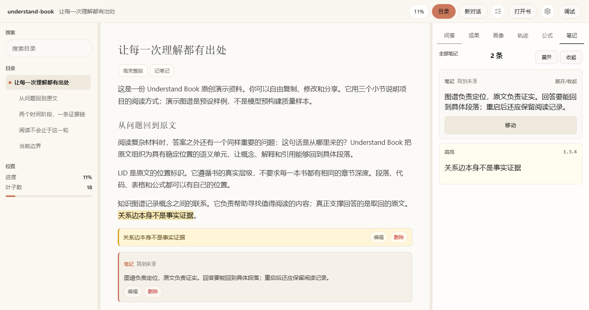
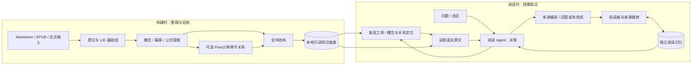

# Understand Book

**将长文整理为可定位、可关联的知识底座，支持 AI 按需查证与持续阅读。**

Rust · TypeScript · Vue 3 · Tauri 2 · MCP

[Quick Start](#quick-start) · [30 秒摘要](#30-秒技术摘要) · [双时序架构](#双时序架构) · [实测结果](#实测而不是预设胜出) · [当前限制](#当前限制)

先看证据：[32 题 / 8 类完整 Agent 评测](evals/semantic/AGENT_EVAL.md) · [单书 2,757 个原文定位单元](evals/semantic/results/2026-09-08-agent-v1/summary.json) · [1,745 条图关系](evals/semantic/results/2026-09-08-agent-v1/summary.json)



*真实服务与生产前端截图。演示文本、笔记为原创，图谱为预设样例；语义评测使用独立的真实书库。*

## 30 秒技术摘要

- **构建时整理知识，阅读时按需取证。** 原文切分为稳定的 LID 层级，构建概念/断言图、篇章关系、公式语义与全书结构；读时先定位，再取原文，最后回答。
- **图谱用于找证据，原文用于支持回答。** MCP 与 Reader 共用 Rust 读取工具；来源定位、模型补充与证据不足有明确边界。
- **把阅读当作持续过程。** Reader 与 Agent 共享视口和选区，笔记、高亮、位置与会话独立持久化。TypeScript 负责预构建，Rust 负责读取/运行时，Vue 提供阅读界面，Tauri 封装本地桌面应用。

## 双时序架构



构建是有成本的离线准备；阅读不把整本书塞进每一轮上下文。源码入口：[构建编排](packages/core/src/build-orchestrator.ts)、[读时工具](crates/read-tools/src/lib.rs)、[Agent 运行时](crates/runtime/src/orchestrator.rs)、[Reader 服务](crates/server/src/lib.rs)、[前端](packages/web/src/App.vue)。

## 实测，而不是预设胜出

使用完整的 `quantification-essence` 书库，32 题覆盖原文定位、概念解释、跨章节、对比、公式、来源跳转、拒绝与重启。其中 **24 道共同问答**比较普通 Chunk RAG 与完整生产 Agent；4 道实际跳转、4 道 Agent 重启恢复单列。

下表为 **2026-09-08 修复前基线**，模型 `deepseek-v4-flash`，每系统每题一次。Agent 走真实 `/agent/chat`，自主搜索、发现工具、回读、修复和交付；评测器不提供检索种子或参考答案。逐题数据见[完整报告](evals/semantic/results/2026-09-08-agent-v1/report.md)，方法见[评测协议](evals/semantic/AGENT_EVAL.md)。

| 系统 | 证据召回 | 引用支持率¹ | 任务成功率¹ | P95 延迟 | 单任务 Token（均值） |
| --- | ---: | ---: | ---: | ---: | ---: |
| Chunk RAG（BM25，单轮） | 84.6% | 88.5% | 91.7%（22/24） | 12.18 s | 4,260 |
| LID + Graph（完整 Resident Agent） | 88.5% | 53.8% | 54.2%（13/24） | 118.60 s | 88,425 |

Agent 在本轮多覆盖了一组参考证据，但没有转化为更好的交付：内容正确率为 **79.2%**，其中 6 题内容正确却没有有效引用，另有 4 题未完成和 1 次最终交付协议错误。共同问答实际发生 **199 次 Agent 模型请求**，所有循环和修复均计入用量。

Agent 专属动作测试中，来源跳转为 **0/4**；四道重启任务的保存/定位准备均未完成，完整恢复为 **0/4**，不能据此断定持久化层丢失数据。正式运行共 325 次被测模型请求，另有 51 次独立判分；重启测试的一条后台画像请求缺失用量，单列为 N/A。

已根据评测修复“普通编号列表被误认成根 LID”的交付误报，25 项来源相关回归通过，修复后的[真实单题验证](evals/semantic/results/2026-09-08-list-marker-fix-probe/report.md)也通过。动作权限传播和无进展恢复仍需改进；单题结果不反写基线。详见[失败链路与改进](evals/semantic/agent-findings.md)，原来的两轮[固定检索消融](evals/semantic/README.md)作为独立实验保留。

后续 [LA7 完整回归](evals/semantic/results/2026-09-08-la7/report.md)为 Agent 15/24、Chunk 20/24，实际跳转与重启恢复均 4/4；同时满足回答、引用和动作的来源题为 1/4。后续独立来源修复及真实前端连续阅读七阶段结果见 [LA7–LA10 实施与验收](docs/LA7-LA10实施与验收.md)，不替换上面的旧基线或固定全量样本。

[LA9 同环消融](evals/semantic/results/2026-09-08-la9-v2/report.md)使用相同循环与预算，每组24题：Text 10/24、Tree 11/24、Graph 9/24。Graph 相对 Tree 新增2道成功、失去4道，本次单书结果没有支持扩大图谱默认使用；具体定位路径、成本、标注偏差与预构建成本限制见[裁决](docs/LA7-LA10实施与验收.md#la9-完整结果与裁决)。

¹ 引用支持率是必要事实中“结论正确且有有效原文引用支持”的比例；无引用计不支持。成功要求全部必要事实与引用通过，拒绝题要求明确不臆造。自然答案由独立模型标注，再核对金标准值、真实答句与引用；来源引用必须能被生产服务解析。参考证据召回、引用支持及完整成功的分母不同，详见协议。

## Quick Start

源码启动需要 **Node.js 22+、pnpm、Rust 工具链**。从仓库根目录执行：

```powershell
pnpm install
pnpm demo:prepare
pnpm build
cargo run -p server --bin server -- .understand-book/quickstart-demo
```

打开终端给出的本地地址，默认 [localhost:8787](http://127.0.0.1:8787)。这条路径不调用模型，可以直接阅读、添加笔记与高亮；首次 Rust 编译需要时间。若端口被占用，先设置 `$env:UNDERSTAND_BOOK_ADDR = "127.0.0.1:8788"`。

要启用 AI 回答，将 [.env.example](.env.example) 复制为 `.env`，填入所选服务的密钥、Base URL 与模型 ID，重启服务。模型调用会将问题与选取的原文发送给该服务，并产生相应费用。

已有完整书库可直接替换最后一项路径，例如：

```powershell
cargo run -p server --bin server -- .understand-book/quantification-essence
```

原书不随仓库分发。新书构建与 Windows 打包见[预构建说明](docs/预购建流程.md)和[桌面发行说明](apps/desktop/README.md)。生成原创演示使用真实分段器，但不调用模型，不代替正式预构建。

## 当前限制

- **评测仍是开发集。** 单书 32 题、每系统一次/题，没有独立盲测或置信区间。语义标注器与被测系统使用同一模型家族；核心事实正确不等于整篇答案无幻觉或教学效果好。延迟来自仍有开发负载的本地设备，不是线上 SLA。
- **基线是产品级对照。** Chunk 是 6000 字符证据预算的单轮 BM25 RAG；Agent 使用生产提示、默认多轮策略与动态工具，预算不同。差异不能单独归因于图谱。另有 LA9 受限工具面的同环消融，但仅是单书单次开发集；尚未比较向量/混合检索或 reranker。
- **自主动作尚有缺口。** 普通跳转/笔记请求的写入权限传播、来源交付、失败后的恢复仍有实测问题。重启评测区分准备失败与持久化失败，不把直接接口 4/4 的旧结果当作自主 Agent 记忆成功率。
- **输入质量决定上限。** PDF/OCR、公式和表格的来源对齐可能存在未解析片段；原文定位能力与语义提取质量需要分别验收。预构建中断后的结果不能只凭文件存在就视为完整。
- **本地优先不等于全离线。** 原书和阅读记录保存在本地，模型推理需要配置外部服务；请根据资料敏感程度选择服务。桌面设置当前将 API key 保存在本机配置文件中。
- **工程仍在迭代。** Windows 桌面、安装程序和插件需保持匹配；旧控制协议的接续由构建引擎判断，公开发布状态以发行说明为准。

## 深入项目

- [完整 Agent 评测方法与复现](evals/semantic/AGENT_EVAL.md)
- [架构与设计决策](docs/架构.md)
- [工具接口](docs/book工具.md)
- [原创演示文本](examples/quickstart/book.md)
