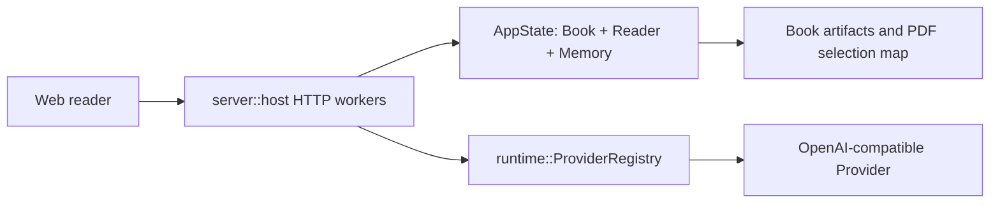

# Architecture

## Components



- **Web reader** owns ephemeral interaction state and calls localhost Reader APIs. `usePdfSelectionDraft` owns native selection resolution; the independent `usePdfSelectionTranslation` controller owns only translation request state.
- **server::host** owns sockets, worker threads, the global `AppState` mutex, Provider configuration snapshots, and lock boundaries.
- **AppState** owns the active immutable `Book` plus mutable Reader, memory, and Agent session state.
- **runtime::ProviderRegistry** constructs Native/ReAct model adapters; timeout-bound adapters apply the supplied duration to the actual HTTP request.

## Major Data Flows

PH5 hybrid foundation construction first partitions each PDF page into top-to-bottom horizontal bands from normalized geometry, then applies the existing single/two-column order inside each band. Paragraph alignment keeps the 240-word local window as its primary path; after a miss it may resume only on one unique 6+ token anchor on the current or following page. Ambiguous or farther candidates remain unmapped, and recovered entries carry explicit lower-confidence provenance.

PDF selection translation follows a two-phase read-only flow:

```text
POST /reader/selection.translate
  -> lock AppState
  -> verify PDF selection-map capability
  -> validate ranges and rebuild canonical resolved quote
  -> copy source/context/lexicon into SelectionTranslationWork
  -> snapshot ProviderConfig
  -> unlock AppState
  -> complete_structured with a 60-second request timeout
  -> validate the one-field Markdown response
  -> return an ephemeral zh-CN projection
```

The Provider call cannot mutate Reader, Agent chat, memory, book text, citations, or caches. Existing Reader requests may acquire `AppState` while translation is waiting on the Provider.

The web translation controller follows `IDLE -> LOADING -> READY | ERROR`. Every start increments a local sequence; new selection, existing selection action, book switch, scroll/zoom, close, or unmount increments it again and clears the surface, so late responses cannot restore stale UI. Repeating the same selection starts a fresh Provider request; no client cache is maintained.

The translation surface is a sibling of the native PDF selection toolbar rather than part of its layout. On desktop it uses the frozen selection screen rectangle, clamps horizontally, and flips above the selection when there is insufficient space below. At narrow widths it becomes a viewport-bound bottom sheet. The original selection and toolbar remain visible in `READY`; while `LOADING`, existing selection actions are disabled but both the translation close action and the selection close action remain available.

## Decision Index

- **PDF selection mapping stability**: [ADR-0079](adr/0079-pdf-selection-banded-reading-order-and-conservative-resynchronization.md).
- **PDF selection translation boundary**: [ADR-0078](adr/0078-pdf-selection-translation-ephemeral-lock-free-bilingual-projection.md).
- **PDF selection and canonical ranges**: [ADR-0074](adr/0074-pdf-selection-actions-and-exact-user-annotation-projection.md).
- **Reader localhost server boundary**: [ADR-0028](adr/0028-前端切片架构-vue-localhost-server-crate-tinyhttp同步-rest命令面1对1投影-不引epub框架-连续正文lid隐形-无页码寻址.md).
- **Provider adapter boundary**: [ADR-0016](adr/0016-自建运行时第一叉-最小agentloop-双层混合驱动-档位同轴-合一轮确定性验停-薄adapter-双重停机.md) and [ADR-0025](adr/0025-book-query内层运行时落地-runtime-crate-modeladapter-scope两档确定性检索-合一轮交叉验停.md).
