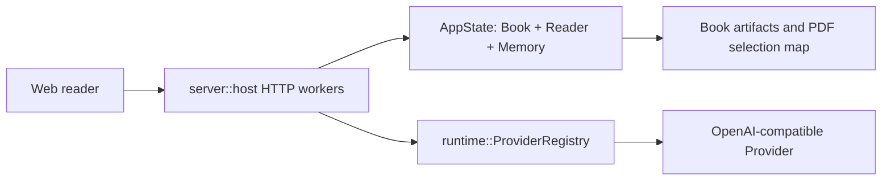

# Architecture

## Components



- **Web reader** owns ephemeral interaction state and calls localhost Reader APIs. `usePdfSelectionDraft` owns native selection resolution; the independent `usePdfSelectionTranslation` controller owns only translation request state.
- **server::host** owns sockets, worker threads, the global `AppState` mutex, Provider configuration snapshots, and lock boundaries.
- **AppState** owns the active immutable `Book` plus mutable Reader, memory, and Agent session state.
- **runtime::ProviderRegistry** constructs Native/ReAct model adapters; timeout-bound adapters apply the supplied duration to the actual HTTP request.
- **read-tools source resolver** validates internal evidence ranges against canonical UTF-16 text and derives deterministic labels, previews, digests, and bounded local context. It does not alter any public `book.*` result.

## Major Data Flows

PH5 hybrid foundation construction first partitions each PDF page into top-to-bottom horizontal bands from normalized geometry, then applies the existing single/two-column order inside each band. Paragraph alignment keeps the 240-word local window as its primary path; after a miss it may resume only on one unique 6+ token anchor on the current or following page. Ambiguous or farther candidates remain unmapped, and recovered entries carry explicit lower-confidence provenance.

Formula geometry is a separate, versioned projection stage. Inside each bounded semantic unit, proven text/code children establish non-overlapping local windows; formula signatures are then enumerated only within their window and only when every matched glyph belongs to one PDF page/column lane. Multiple formulas sharing a window bind only through one unique complete monotonic chain. Standalone and one-sided formulas can therefore produce region evidence without invented paragraph boxes, while repeated, cross-lane, or boundary-conflicting candidates remain explicitly unmapped. This stage never creates source assignments; formula token-to-glyph evidence is owned by the following structural formula stage.

```text
formula_source_ast.v1 visible signature
  + PR12 exclusive child window
  + PDF page/column alignment lines
  -> pdf_formula_region_policy.v1 candidate lanes
  -> unique complete monotonic chain
  -> region_exact | explicit structural ambiguity
  -> policy-bound V2 map/report config hash
```

The structural formula stage compiles the positioned formula AST into a closed set of visible glyph variants. Every glyph token retains its source span; scripts, fractions, roots, stacks, large-operator limits, accents, and braces add parent-child geometry constraints. A projection is emitted only for a complete contiguous token match with unique PDF character IDs and valid two-dimensional relations. The resulting formula remains `partial`: selection shards contain only proven glyph assignments, while invisible markup has no rectangle. Missing or changed glyphs, flat script geometry, cross-lane candidates, unknown commands, and duplicate ownership remain explicit failures.

```text
formula_source_ast.v1 nodes + pdf_formula_region_policy.v1 local window
  -> pdf_formula_glyph_policy.v1 token variants and geometry constraints
  -> complete unique glyph/source-span assignment
  -> partial formula entry + exact glyph selection shard rows
  -> Core map/report version parity + Server unknown-version rejection
```

Image geometry is a separate object-only projection stage. PDF.js operator lists are interpreted with their graphics-state transforms to expose raster, inline, mask, and vector Form bounding boxes in PDF user space. Source image order, proven text/formula boundaries, adjacent same-page caption geometry, and already-proven neighboring asset bindings may establish one unique object chain. No image pixels, alt text, OCR output, nearest-object heuristic, caption box, or full-page box participates. An accepted image produces a region-only entry; an ambiguous or absent object remains explicitly unmapped. Image-only units are excluded from text location quality and never contribute rows to a selection shard.

```text
PDF.js operator list + graphics transforms
  -> image/Form object bboxes
  + source image order + proven caption/text/asset anchors
  -> pdf_asset_region_policy.v1 unique object chain
  -> asset region_exact | asset_unmapped
  -> zero source assignments and zero selection-shard rows
```

Native PDF selection is owned by the public PDF.js `TextLayerBuilder` lifecycle. Each rendered page retains its builder until zoom, rerender, book switch, or unmount cancels it and removes the text-layer DOM. The builder's `.endOfContent` and selection-change contract stabilize browser caret placement at visual line and paragraph boundaries; the existing mouseup capture then forwards the resulting `Selection` without quote or rectangle heuristics.

PDF selection translation follows a two-phase read-only flow:

```text
POST /reader/selection.translate
  -> lock AppState
  -> verify PDF selection-map capability
  -> validate ranges and rebuild canonical resolved quote
  -> copy source/context/lexicon into SelectionTranslationWork
  -> snapshot ProviderConfig
  -> unlock AppState
  -> complete_structured with a 60-second request timeout
  -> validate the one-field Markdown response
  -> return an ephemeral zh-CN projection
```

The Provider call cannot mutate Reader, Agent chat, memory, book text, citations, or caches. Existing Reader requests may acquire `AppState` while translation is waiting on the Provider.

The web translation controller follows `IDLE -> LOADING -> READY | ERROR`. Every start increments a local sequence; new selection, existing selection action, book switch, scroll/zoom, close, or unmount increments it again and clears the surface, so late responses cannot restore stale UI. Repeating the same selection starts a fresh Provider request; no client cache is maintained.

The translation surface is a sibling of the native PDF selection toolbar rather than part of its layout. On desktop it uses the frozen selection screen rectangle, clamps horizontally, and flips above the selection when there is insufficient space below. At narrow widths it becomes a viewport-bound bottom sheet. The original selection and toolbar remain visible in `READY`; while `LOADING`, existing selection actions are disabled but both the translation close action and the selection close action remain available.

User-visible Agent sources begin with a deterministic read-tools projection:

```text
internal EvidenceRange
  -> validate real leaf reading order and UTF-16 subranges
  -> preserve continuous canonical text, including structural headings
  -> choose the smallest common chapter/section context boundary
  -> derive original-language heading path + localized kind
  -> compute preview + stable evidence digest
  -> ResolvedSource
```

Runtime now owns a per-turn evidence ledger around the common post-dispatch/pre-Tool-message point. Only server-validated selection ranges, gated `book.query` citations, filtered `book.synthesize` citations, and successful `book.text` reads enter the ledger. `source.present` can select only a covered continuous subset and creates a Rust-only `SourceBinding`; context, route, Reader state, failed tools, and arbitrary LIDs never enter the ledger. The binding is deliberately skipped by current `OuterOutcome` serialization until SR4 introduces a separate durable server contract.

Final Agent prose passes through a shared Native/ReAct compiler before delivery. Controlled `[[source:<ref>]]` markers become typed Markdown/source parts, adjacent refs collapse into one source part, and unused temporary bindings are discarded. The compiler rejects unknown or cross-turn refs, malformed markers, and raw internal LIDs. One request-only, tool-free repair is allowed; a second invalid candidate is replaced by a typed fail-closed answer. Durable provider messages contain only the marker-free compatibility answer, while `answer_view` carries the opaque typed projection.

Server history now separates its durable model from public Agent views. Each completed internal turn owns the pruned `SourceBinding` records needed for replay, but `AgentChatTurnView` exposes only opaque answer refs, semantic question labels, compact question quote data, and semantic effect labels. `/agent/source.resolve` revalidates the stored digest against the active canonical book; a mismatch returns only label/preview snapshots with navigation disabled. `/agent/source.open` repeats the same validation and performs the Reader command server-side, so the source API never accepts or returns a LID.

`RightRail` renders `AgentAnswerView.parts` in order, placing a compact blue button directly after the Markdown span it supports. A single ref uses its deterministic semantic label; adjacent refs are one count button. The first click sends only `(turn_id, source_ref_id)` to `/agent/source.resolve` and leaves the Reader untouched. Desktop uses a viewport-clamped anchored dialog; screens at 700px or below use a viewport-bound bottom sheet. The dialog highlights the exact canonical evidence inside continuous bounded context, and only its explicit `source.open` action synchronizes the main Reader. A monotonically increasing request sequence prevents a late resolve/open response from restoring a closed or superseded popup. Question quote headers, effect rows, and history summaries consume semantic server labels; raw effect data remains available only to existing commands and the explicitly excluded trace surface.

Legacy Agent answers are adapted only in the read path. A conservative Markdown-aware scanner recognizes the historical `[LID: real.node]` citation shape only outside fenced, indented, inline, and raw HTML code, escaped text, links, images, and reference definitions. It verifies the candidate against the active canonical book, derives a deterministic opaque ref, and builds the same typed answer view without mutating history. Bare numbers, invalid nodes, and ambiguous prose remain byte-for-byte visible. The source endpoints reconstruct the same temporary binding from turn/ref, so restart replay is stable; changing books or deleting the owning history makes the ref unavailable. Since old turns never stored a digest snapshot, this compatibility path intentionally binds only to a currently valid explicit node and does not invent stale recovery.

## Decision Index

- **Runtime-owned user-visible source references**: [ADR-0086](adr/0086-runtime-owned-user-visible-source-references.md).
- **PDF text-layer native selection lifecycle**: [ADR-0080](adr/0080-pdf-text-layer-native-selection-lifecycle.md).
- **PDF selection mapping stability**: [ADR-0079](adr/0079-pdf-selection-banded-reading-order-and-conservative-resynchronization.md).
- **PDF selection translation boundary**: [ADR-0078](adr/0078-pdf-selection-translation-ephemeral-lock-free-bilingual-projection.md).
- **PDF selection and canonical ranges**: [ADR-0074](adr/0074-pdf-selection-actions-and-exact-user-annotation-projection.md).
- **Reader localhost server boundary**: [ADR-0028](adr/0028-前端切片架构-vue-localhost-server-crate-tinyhttp同步-rest命令面1对1投影-不引epub框架-连续正文lid隐形-无页码寻址.md).
- **Provider adapter boundary**: [ADR-0016](adr/0016-自建运行时第一叉-最小agentloop-双层混合驱动-档位同轴-合一轮确定性验停-薄adapter-双重停机.md) and [ADR-0025](adr/0025-book-query内层运行时落地-runtime-crate-modeladapter-scope两档确定性检索-合一轮交叉验停.md).
