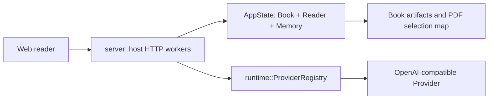
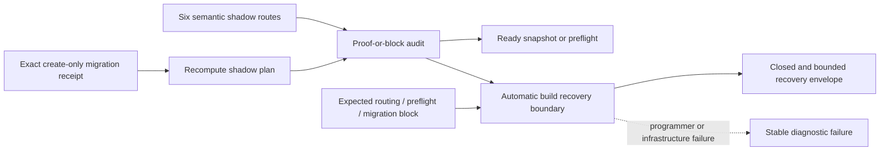

# Architecture

## Components

```mermaid
flowchart LR
  Source[Canonical source and original LIDs] --> Release[BR8 release policy set]
  Release --> Pass1Router[Pass1 production v3 router]
  Release --> ProfileRouter[Profile-sidecar production v3 router]
  Pass1Router --> Whole[Whole or grouped window]
  Pass1Router --> Fragment[Proof-bound source fragments]
  Whole --> ShadowArtifacts[Policy-qualified task-private v3 artifacts]
  Fragment --> ShadowArtifacts
  ShadowArtifacts --> Stitch[Bounded deterministic stitch tree]
  Stitch --> PrivateCandidate[Task-private Pass1 final candidate]
  ProfileRouter --> ProfileCandidate[Task-private discourse final candidate]
  PrivateCandidate --> Quality[Quality report v2]
  ProfileCandidate --> Quality
  Quality --> Batch[Semantic stage batch]
  Batch --> Publish[Transactional stage publication]
  Publish --> PublicArtifacts[base.json / discourse_index.json / formula_semantics.json]
  Publish --> Receipt[Committed publication receipt]
  Receipt --> Close[Post-publication close coordinator]
  PublicArtifacts --> Close
  Close --> CloseResult[Create-only close result]
  CloseResult --> Replan[Mandatory plan/next]
  LegacyLease[Active v2 generation lease] -. blocks activation .-> Recovery[Bounded migration recovery]
```







- **Web reader** owns ephemeral interaction state and calls localhost Reader APIs. `ReaderPane` owns a mounted LID registry, IntersectionObserver-maintained visible candidates and edge sentinels, one rAF scroll-state coalescer, and the ResizeObserver-fed `reader-height-ledger` projection for render-item height, top/bottom spacer and next-frame anchor correction; Note open state is keyed by `mem_id` outside recyclable DOM. `StableReaderSegment` owns body HTML identity so anchor/selection/Note-only parent updates do not re-run Markdown/KaTeX; App builds one annotation index and one source-focus range projection per input revision, then sends only affected LID render revisions. `ReaderSegmentHtmlCache` owns source/book/renderer-scoped base HTML with a `5w` LRU; final Highlight/focus `<mark>` and Note DOM remain outside the cache. App's `ReaderEdgeLoadGate` and serialized Reader command queue own epoch/direction request identity so replacement windows reject stale edge receipts and edge scroll cannot race navigation. The pure `reader-buffer` reducer owns contiguous `insert/keep/evict` identity ranges, `3w/4w` budgets, one incoming transition, epoch/transition receipt identity and interaction-pin trim debt; App projects each current receipt into the authoritative mounted segment slice, while selection/Note pins may temporarily retain the `4w` transient slice until release. `ReaderHydrator` owns source-scoped range hydration: it partitions text misses into canonical consecutive ranges, shares per-LID in-flight promises, derives FormulaSemantics positive/negative entries from one hit-only range, and bounds text plus formula settled LRUs independently to `5w`. Replacement navigation and book switches abort active range transports and advance the hydration epoch before any late reply can mutate caches; `batched_hydration_v1=0` retains the singular path only as an explicit rollback. App independently projects Manifest `display_title` into one title map shared by outline and chapter read position; title construction issues no `book.text` request and never joins the first-segment dependency chain. `usePdfSelectionDraft` owns native selection resolution; the independent `usePdfSelectionTranslation` controller owns only translation request state.
- **server::host** owns sockets, worker threads, the global `AppState` mutex, Provider configuration snapshots, and lock boundaries.
- **AppState** owns the active immutable `Book` plus mutable Reader, memory, and Agent session state.
- **runtime::ProviderRegistry** constructs Native/ReAct model adapters; timeout-bound adapters apply the supplied duration to the actual HTTP request.
- **read-tools** projects every Manifest node's `display_title` from the first non-empty line inside its canonical span, strips an ATX heading marker, truncates at a valid 80-unit UTF-16 boundary and falls back to LID. It also validates `book.text(start,end)` as an ordered consecutive leaf interval before slicing canonical UTF-16 text. Its formula-range projection reuses that interval identity, returns only sidecar hits in canonical leaf order, and rejects duplicate or mismatched Formula identities. The independent source resolver validates internal evidence ranges and derives deterministic labels, previews, digests, and bounded local context.
- **Pass1 production v3 router** preserves source/LID identity while selecting a byte-identical whole/group path or exact-cover model-input fragments. Every model unit and stitch dependency is proof/policy/hash bound; only a root final may emit a task-private `Pass1Artifact` candidate. Quality-v2 must prove the complete public-contributor closure before the existing transaction publishes `base.json`.
- **Profile-sidecar production v3 router** selects a whole-unit semantic fast path or exact-cover discourse fragments with bounded deterministic reduction. Its task-private final is route- and receipt-bound; quality-v2 excludes intermediates from the public denominator and gates transactional publication of discourse/formula sidecars.
- **Automatic build recovery boundary** owns the allowlisted `automatic_build_recovery.v1` protocol, projects only target identity and bounded work-unit/LID references, and canonicalizes the result without source text, prompts, paths, stderr, or stacks. BR7 callers consume only `ready(value)` or `blocked(recovery)`; unexpected failures remain outside the envelope.
- **Automatic build routing audit** requires the canonical six semantic stages and verifies every eligible descriptor against its exact rendered bytes and budget proof. A smaller selected executor context blocks without changing reserves; audit and recovery projection create no task, lease, dispatch, or attempt. Exact migration receipts may trigger a deterministic replan, while generation conflicts and active v2 generation leases stop at the same recovery boundary. BR8 activates v3/quality-v2 for Pass1 and profile-sidecar; later stages retain their compatibility routes until their own release slices.
- **Automatic build close coordinator** consumes only the strict batch publication result, validates the committed receipt and current public bytes, rebuilds the snapshot, recomputes quality/coverage/freshness, and then writes a transaction-bound create-only close result with `next=replan`. Missing/invalid receipts and post-publication drift become bounded recovery; metrics run only after verified close. Paper-reading-guide keeps a separate verification-only result and never fabricates a semantic receipt. ([ADR-0100 §4–§6](adr/0100-budget-routable-model-work-units-and-truthful-build-recovery.md))
- **Automatic build release v3 boundary** binds production routing, model-input budgets, seven Pass1/Profile policy members, recovery, quality-v2, batch publication, and strict close reading under one active identity. The read-only doctor proves those members and readers while the packaged Sidecar supplies all ten extractor prompts plus the dispatch wrapper; Node and Bun must return byte-identical task/dispatch prompts. The public plugin stays thin (`agents/` absent), so it never borrows prompt assets or Core source from the repository root.

## Major Data Flows

Markdown reader scroll-state work is independent from hydration and buffer eviction:

```text
template LID refs + visibility/edge IntersectionObservers
  -> one requestAnimationFrame coalescer
  -> 28% probe over ordered visible candidates -> emit current LID only on change
  -> edge direction -> ReaderEdgeLoadGate(epoch, direction, requestId)
  -> reader-buffer plan(insert, keep, evict, anchor, epoch) with one incoming transition
  -> serialize authoritative reader.scroll with navigation, then hydrate existing per-LID path
  -> commit reducer receipt + project App segments to settled range only while token is current
  -> interaction pin may retain transient range; final pin release projects pending trim
  -X-> replace/goto/book switch invalidates stale success and failure receipts
  -> ReaderPane projects mounted range through the source/layout/renderer-scoped height ledger
  -> top/bottom spacer preserve virtual extent; next-frame correction restores preserved anchor
```

Markdown body rendering is revision-scoped and keeps overlays outside the base cache:

```text
annotations + mounted LIDs -> one ReaderAnnotationIndex
source focus + mounted segments -> one focus-range projection
  -> per-LID render revision only for ranged Highlight/focus changes
  -> StableReaderSegment watches source/renderer/segment/revision identity
  -> ReaderSegmentHtmlCache(book, source, renderer, lid, kind, text; max 5w)
  -> base Markdown/KaTeX HTML
  -> ranged Highlight/focus marks + parent-owned classes/cards/Note DOM
```

PHR6 range primitives feed PHR7's source-scoped hydration path:

```text
GET book.text(first, last)
  -> validate consecutive leaf identities, UTF-16 spans, order and whitespace-only gaps
  -> one canonical UTF-16 response
  + requested Manifest leaves -> splitUtf16Range -> exact per-LID text map

GET book.formula_semantics_range(first, last)
  -> the same validated leaf interval
  -> ordered, unique, interval-bounded FormulaSemantics hits
  -> requested formula LIDs - returned hits = same-source negative-cache set

requested mounted/preview LIDs + Manifest leaf order + source fingerprint + epoch
  -> settled text/formula cache hits + shared in-flight LID promises
  -> group consecutive text misses -> one book.text(first, last) per gap
  -> splitUtf16Range -> exact per-LID text
  -> coalesce missing Formula leaves -> zero or one FormulaSemantics range per cold window
  -> validate response identities/order -> positive and negative formula entries
  -> epoch/current-source check -> Segment[] in requested order
  -> text LRU <= 5w and formula positive/negative LRU <= 5w
  -X-> goto/replace/book switch aborts transports and rejects late success/failure

batched_hydration_v1=0 -> explicit singular text/formula rollback path
```

Manifest title projection is local to the topology response and independent from body hydration:

```text
Book::manifest + canonical UTF-16 source
  -> each ManifestNode span -> first non-empty line -> strip heading marker
  -> truncate at <= 80 UTF-16 units without splitting a surrogate; blank/invalid -> LID
  -> one display_title field shared by REST, Book MCP and generated TS contract
  -> App.projectReaderManifestTitles -> outline + titleByLid
  -> active outline / chapter read position consume the same title
  -> first Segment render has zero outline/chapter book.text requests
```

Pass1 budget routing keeps fitting windows eligible for exact v2 artifact adoption into the frozen v3 generation. An over-limit paragraph is split only at the model-input layer; each fragment returns nodes and local edges anchored to the original parent LID. Core gates and merges verified child graphs deterministically, while bounded `pass1_lid_stitch` calls may propose only local cross-fragment edges. Missing ranges, duplicate children, stale hashes, invalid proofs, or a root artifact whose route differs from its frozen task stop before a final candidate is produced.

```text
Pass1 window + exact renderer proof
  -> frozen release policy set
  -> whole/group production unit | exact-cover pass1_source_slice[0..N]
  -> receipt-bound create-only semantic_task_artifact.v3 graphs
  -> deterministic merge/evidence gate + bounded pass1_lid_stitch levels
  -> frozen root-route revalidation
  -> task-private Pass1 public candidate
  -> automatic_build_stage_quality_report.v2
  -> transactional pass1-batch publication -> public base.json
```

BR7's no-claim audit and recovery projection remain the control boundary around BR8 production routing:

```text
confirmed BuildPlan + current target + six shadow stage routes
  -> verify exact rendered bytes / proof / selected executor context
  -> ready(production snapshot or preflight)
  |  blocked(automatic_build_recovery.v1) -> plan / next / protocol-doctor
  -X-> task / lease / dispatch / attempt

exact migration receipt -> recompute plan
active v2 lease, generation conflict, or changed BuildPlan budget -> needs_user(recovery)
```

Profile-sidecar uses the same release and publication boundary:

```text
canonical windows + frozen profile policy set
  -> whole semantic fast path | exact-cover discourse fragments
  -> receipt-bound v3 artifacts -> deterministic reduction -> task-private final
  -> quality-v2 contributor/dependency closure
  -> transactional profile-sidecar publication
```

All six semantic stage batches close through the same publication proof boundary:

```text
passed pre-close quality/coverage
  -> semantic batch publishes transaction
  -> AutomaticBuildStageBatchResultV1(stdout); human logs(stderr)
  -> validate stage/transaction/allowlisted paths/size/hash/current bytes
  -> rebuild snapshot from disk
  -> recompute quality/coverage/freshness
  -> create-only AutomaticBuildStageCloseResultV1(next=replan)
  |  automatic_build_recovery.v1(publication_receipt_invalid | stage_close_postcondition_failed)
```

PH5 hybrid foundation construction first partitions each PDF page into top-to-bottom horizontal bands from normalized geometry, then applies the existing single/two-column order inside each band. Paragraph alignment keeps the 240-word local window as its primary path; after a miss it may resume only on one unique 6+ token anchor on the current or following page. Ambiguous or farther candidates remain unmapped, and recovered entries carry explicit lower-confidence provenance.

Formula geometry is a separate, versioned projection stage. Inside each bounded semantic unit, proven text/code children establish non-overlapping local windows; formula signatures are then enumerated only within their window and only when every matched glyph belongs to one PDF page/column lane. Multiple formulas sharing a window bind only through one unique complete monotonic chain. Standalone and one-sided formulas can therefore produce region evidence without invented paragraph boxes, while repeated, cross-lane, or boundary-conflicting candidates remain explicitly unmapped. This stage never creates source assignments; formula token-to-glyph evidence is owned by the following structural formula stage.

```text
formula_source_ast.v1 visible signature
  + PR12 exclusive child window
  + PDF page/column alignment lines
  -> pdf_formula_region_policy.v1 candidate lanes
  -> unique complete monotonic chain
  -> region_exact | explicit structural ambiguity
  -> policy-bound V2 map/report config hash
```

The structural formula stage compiles the positioned formula AST into a closed set of visible glyph variants. Every glyph token retains its source span; scripts, fractions, roots, stacks, large-operator limits, accents, and braces add parent-child geometry constraints. A projection is emitted only for a complete contiguous token match with unique PDF character IDs and valid two-dimensional relations. The resulting formula remains `partial`: selection shards contain only proven glyph assignments, while invisible markup has no rectangle. Missing or changed glyphs, flat script geometry, cross-lane candidates, unknown commands, and duplicate ownership remain explicit failures.

```text
formula_source_ast.v1 nodes + pdf_formula_region_policy.v1 local window
  -> pdf_formula_glyph_policy.v1 token variants and geometry constraints
  -> complete unique glyph/source-span assignment
  -> partial formula entry + exact glyph selection shard rows
  -> Core map/report version parity + Server unknown-version rejection
```

Image geometry is a separate object-only projection stage. PDF.js operator lists are interpreted with their graphics-state transforms to expose raster, inline, mask, and vector Form bounding boxes in PDF user space. Source image order, proven text/formula boundaries, adjacent same-page caption geometry, and already-proven neighboring asset bindings may establish one unique object chain. No image pixels, alt text, OCR output, nearest-object heuristic, caption box, or full-page box participates. An accepted image produces a region-only entry; an ambiguous or absent object remains explicitly unmapped. Image-only units are excluded from text location quality and never contribute rows to a selection shard.

```text
PDF.js operator list + graphics transforms
  -> image/Form object bboxes
  + source image order + proven caption/text/asset anchors
  -> pdf_asset_region_policy.v1 unique object chain
  -> asset region_exact | asset_unmapped
  -> zero source assignments and zero selection-shard rows
```

All projected child candidates pass through one versioned ownership stage before foundation artifacts are constructed. Shared region or selection resources form conflict components in source order. A unique complete glyph owner may exclude a partial candidate only when both have the same structural role; source order is evidence for a valid non-overlapping solution, never a tiebreaker. Cross-role conflicts, multiple complete owners, and otherwise equal solutions fail the whole component closed. Every rejected candidate records a competitor, the violated constraint, and the contested resources. The artifact integrity gate independently recomputes region and selection ownership, so a corrupted double owner cannot be hidden by stale report diagnostics.

```text
text/code/formula/image projection candidates
  + source order + exclusive child windows + structural roles
  + complete glyph ownership
  -> pdf_binding_ownership_policy.v1 conflict components
  -> unique accepted projections | whole-group ambiguous_binding
  -> duplicate-free V2 map/selection shards
  -> independently recomputed artifact integrity gate
```

Native PDF selection is owned by the public PDF.js `TextLayerBuilder` lifecycle. Each rendered page retains its builder until zoom, rerender, book switch, or unmount cancels it and removes the text-layer DOM. The builder's `.endOfContent` and selection-change contract stabilize browser caret placement at visual line and paragraph boundaries; the existing mouseup capture then forwards the resulting `Selection` without quote or rectangle heuristics.

PDF selection translation follows a two-phase read-only flow:

```text
POST /reader/selection.translate
  -> lock AppState
  -> verify PDF selection-map capability
  -> validate ranges and rebuild canonical resolved quote
  -> copy source/context/lexicon into SelectionTranslationWork
  -> snapshot ProviderConfig
  -> unlock AppState
  -> complete_structured with a 60-second request timeout
  -> validate the one-field Markdown response
  -> return an ephemeral zh-CN projection
```

The Provider call cannot mutate Reader, Agent chat, memory, book text, citations, or caches. Existing Reader requests may acquire `AppState` while translation is waiting on the Provider.

The web translation controller follows `IDLE -> LOADING -> READY | ERROR`. Every start increments a local sequence; new selection, existing selection action, book switch, scroll/zoom, close, or unmount increments it again and clears the surface, so late responses cannot restore stale UI. Repeating the same selection starts a fresh Provider request; no client cache is maintained.

The translation surface is a sibling of the native PDF selection toolbar rather than part of its layout. On desktop it uses the frozen selection screen rectangle, clamps horizontally, and flips above the selection when there is insufficient space below. At narrow widths it becomes a viewport-bound bottom sheet. The original selection and toolbar remain visible in `READY`; while `LOADING`, existing selection actions are disabled but both the translation close action and the selection close action remain available.

User-visible Agent sources begin with a deterministic read-tools projection:

```text
internal EvidenceRange
  -> validate real leaf reading order and UTF-16 subranges
  -> preserve continuous canonical text, including structural headings
  -> choose the smallest common chapter/section context boundary
  -> derive original-language heading path + localized kind
  -> compute preview + stable evidence digest
  -> ResolvedSource
```

Runtime now owns a per-turn evidence ledger around the common post-dispatch/pre-Tool-message point. Only server-validated selection ranges, gated `book.query` citations, filtered `book.synthesize` citations, and successful `book.text` reads enter the ledger. `source.present` can select only a covered continuous subset and creates a Rust-only `SourceBinding`; context, route, Reader state, failed tools, and arbitrary LIDs never enter the ledger. The binding is deliberately skipped by current `OuterOutcome` serialization until SR4 introduces a separate durable server contract.

Final Agent prose passes through a shared Native/ReAct compiler before delivery. Controlled `[[source:<ref>]]` markers become typed Markdown/source parts, adjacent refs collapse into one source part, and unused temporary bindings are discarded. The compiler rejects unknown or cross-turn refs, malformed markers, and raw internal LIDs. One request-only, tool-free repair is allowed; a second invalid candidate is replaced by a typed fail-closed answer. Durable provider messages contain only the marker-free compatibility answer, while `answer_view` carries the opaque typed projection.

Server history now separates its durable model from public Agent views. Each completed internal turn owns the pruned `SourceBinding` records needed for replay, but `AgentChatTurnView` exposes only opaque answer refs, semantic question labels, compact question quote data, and semantic effect labels. `/agent/source.resolve` revalidates the stored digest against the active canonical book; a mismatch returns only label/preview snapshots with navigation disabled. `/agent/source.open` repeats the same validation and performs the Reader command server-side, so the source API never accepts or returns a LID.

`RightRail` renders `AgentAnswerView.parts` in order, placing a compact blue button directly after the Markdown span it supports. A single ref uses its deterministic semantic label; adjacent refs are one count button. The first click sends only `(turn_id, source_ref_id)` to `/agent/source.resolve` and leaves the Reader untouched. Desktop uses a viewport-clamped anchored dialog; screens at 700px or below use a viewport-bound bottom sheet. The dialog highlights the exact canonical evidence inside continuous bounded context, and only its explicit `source.open` action synchronizes the main Reader. A monotonically increasing request sequence prevents a late resolve/open response from restoring a closed or superseded popup. Question quote headers, effect rows, and history summaries consume semantic server labels; raw effect data remains available only to existing commands and the explicitly excluded trace surface.

Legacy Agent answers are adapted only in the read path. A conservative Markdown-aware scanner recognizes the historical `[LID: real.node]` citation shape only outside fenced, indented, inline, and raw HTML code, escaped text, links, images, and reference definitions. It verifies the candidate against the active canonical book, derives a deterministic opaque ref, and builds the same typed answer view without mutating history. Bare numbers, invalid nodes, and ambiguous prose remain byte-for-byte visible. The source endpoints reconstruct the same temporary binding from turn/ref, so restart replay is stable; changing books or deleting the owning history makes the ref unavailable. Since old turns never stored a digest snapshot, this compatibility path intentionally binds only to a currently valid explicit node and does not invent stale recovery.

## Decision Index

- **Budget-routable model work units and truthful build recovery**: [ADR-0100](adr/0100-budget-routable-model-work-units-and-truthful-build-recovery.md).
- **Runtime-owned user-visible source references**: [ADR-0086](adr/0086-runtime-owned-user-visible-source-references.md).
- **PDF text-layer native selection lifecycle**: [ADR-0080](adr/0080-pdf-text-layer-native-selection-lifecycle.md).
- **PDF selection mapping stability**: [ADR-0079](adr/0079-pdf-selection-banded-reading-order-and-conservative-resynchronization.md).
- **PDF selection translation boundary**: [ADR-0078](adr/0078-pdf-selection-translation-ephemeral-lock-free-bilingual-projection.md).
- **PDF selection and canonical ranges**: [ADR-0074](adr/0074-pdf-selection-actions-and-exact-user-annotation-projection.md).
- **Reader localhost server boundary**: [ADR-0028](adr/0028-前端切片架构-vue-localhost-server-crate-tinyhttp同步-rest命令面1对1投影-不引epub框架-连续正文lid隐形-无页码寻址.md).
- **Bounded reader buffer and scroll hot path**: [ADR-0105](adr/0105-bounded-reader-buffer-stable-rendering-and-batched-source-loading.md).
- **Provider adapter boundary**: [ADR-0016](adr/0016-自建运行时第一叉-最小agentloop-双层混合驱动-档位同轴-合一轮确定性验停-薄adapter-双重停机.md) and [ADR-0025](adr/0025-book-query内层运行时落地-runtime-crate-modeladapter-scope两档确定性检索-合一轮交叉验停.md).
