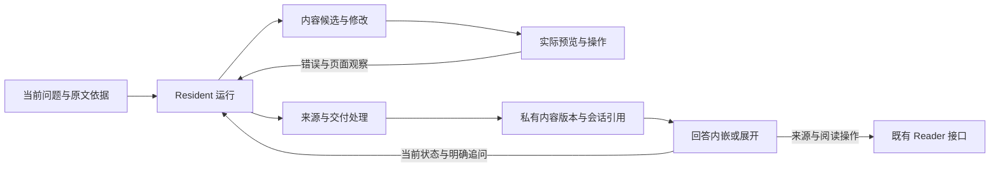

# Agent 富呈现与读时内容制作切片方案

状态：RP0–RP7 完成；RP8 未实施。更新于 2026-09-17。产品与边界决策见 [ADR-0130](adr/0130-agent-rich-presentation-and-read-time-authoring.md)，移动宿主与多环境扩展见 [ADR-0131](adr/0131-mobile-reading-workspace-and-viewport-projection.md) 及其 MW5–MW6，术语见 [CONTEXT](../CONTEXT.md)。RP1 两平台实现与证据见 [验收记录](performance/agent-presentation-rp1-20260916.md)；RP2 验证见 [RP2 记录](performance/agent-presentation-rp2-20260917.md)；RP3 接口、内容编写合同及浏览器证据见 [RP3 记录](performance/agent-presentation-rp3-20260917.md)。RP4 工具、真实模型修正与挂载证据见 [RP4 记录](performance/agent-presentation-rp4-20260917.md)。RP5 现场与追问合同见 [RP5 记录](performance/agent-presentation-rp5-20260917.md)。RP6 持续修改与恢复见 [RP6 记录](performance/agent-presentation-rp6-20260917.md)。RP7 两平台完整验收和复跑见 [RP7 记录](performance/agent-presentation-rp7-20260917.md)。后续模块路径仍是实施候选。

## 0 对齐与范围

**FrozenIntent**：让 Resident Agent 根据当前问题选择呈现方式，在回答内容区域内遵循共同样式现场编写、预览和修改 HTML/CSS/JavaScript，支持普通富排版、交互讲解、可运行教具和持续更新的内容。首版交付包含生成、运行反馈、修改、来源关联、当前状态追问及重开恢复。

**确认依据**：用户补充“可交互的 html 不仅是教具”，要求同时讨论对话页面美观、重点表达和 coding agent 能力；在“首版现场编写和修改 HTML/CSS/JavaScript”与“先限定为组合预置组件”之间明确选择“前者”。已说明现场制作的等待成本、运行不等于内容正确，以及现有任意 UI 限制需要修订。此回执确认产品方向；具体预览宿主尚待技术验证。

**ChangeType**：回答呈现与内容制作的边界扩展。通用呈现沿用现有阅读就绪条件；正式 TutorLoop、判题及长期学习状态沿用各自设计，接入作为独立后续切片。

| 术语 | 状态 | 本方案含义 |
| --- | --- | --- |
| Resident 运行、回答草稿、用户可见来源引用 | EXISTING | 沿用运行、公开展示及来源绑定边界 |
| AgentPresentation | NEW | 与对话关联、可继续修改的 Agent 呈现内容 |
| PresentationState | NEW | 某一内容版本实际可观察的交互现场 |
| 交互教具 | NEW | AgentPresentation 用于观察、比较、试验或构造理解的教学用途 |
| TutorPresentation | BOUNDARY_CHANGE | 正式教学可引用实际交付的 AgentPresentation 版本及现场 |
| TutorInteraction | BOUNDARY_CHANGE | 自由视觉呈现与已有类型化教学行为分开表达 |
| ArtifactBlueprint | EXISTING | 继续承载数据，作为可选素材来源 |

上述术语及呈现边界已落入 CONTEXT；产品范围对齐完成。RP1 的技术选择不改变已确认的现场制作目标。

## 1 产品行为与验收场景

普通段落、公式及引用继续可用。Agent 按内容选用重点摘要、并排比较、图文组织、折叠展开、数据联动或可运行内容；常见样式和控件可复用，表达方式不限于预置形态。内容可内嵌在回答中，也可展开；读者能针对当前对象继续追问、要求修改，并在之后恢复。

| 场景 | 必须可观察的行为 |
| --- | --- |
| 普通回答 | 现场生成有重点和并排比较的内容，来源能回到原文；既有短回答无需进入制作循环 |
| 参数实验 | 用户调整参数，页面立即计算；“解释现在的结果”把实际参数和显示结果交给 Agent |
| 持续内容 | “给刚才的对照增加一个例子”修改同一内容并形成新版本；旧对话仍能查看旧版 |
| 运行修正 | 生成内容首次发生脚本错误或关键操作无效时，Agent 获得实际反馈并修改后再交付 |
| 重新打开 | 恢复已交付内容与已保存现场，来源仍可定位，后续修改无需从头重建 |

首个有来源的教学样例采用 [原创演示资料](../examples/quickstart/book.md) 中的证据召回率：需要三处证据，选择两处时为 2/3；加入无关材料不改变召回率，补齐第三处后为 1。页面同时呈现“找到证据”与“忠实使用证据”的区别。该样例用于呈现与反馈验收，正式学习判断另行接入。

教具按认知用途选用：结构关系图、多种表示联动、参数实验、过程演示、案例与反例比较、论证与证据展开、构造重组、语言文本分析、练习诊断及可运行代码实验。这些是设计素材，不组成封闭产品枚举；每个实际教具需有明确目标、来源或模型假设及可观察结果。

## 2 所有权与接入边界

| 所有者 | 责任 |
| --- | --- |
| Resident Agent | 选择表达方式、编写和修改内容、根据运行反馈修正，并解释读者当前状态 |
| Runtime | 制作能力发现与调用、预算和取消、候选交付、来源编译及模型上下文投影 |
| Reader/Server | 书籍与会话归属、内容持久化、当前现场接收、来源与既有操作路由 |
| 预览宿主 | 执行候选、实际操作、返回错误及页面观察、停止执行并释放资源 |
| Web 呈现宿主 | 提供共同样式、内嵌与展开视图、内容运行区域、交互与追问入口 |
| 正式教学边界 | TutorPresentation、类型化提交、AssessmentContract、InteractionTrace 与 LearningEvidence |



内容及读者现场保存在 Reader 私有区域，与书籍和对话关联。公共书基座、Blueprint 数据产物与私人学习判断各自保持现有所有权。日常富回答不以整份 TeachingMap 就绪为前置条件；进入正式 TutorLoop 时仍遵循 [ADR-0120](adr/0120-whole-source-prebuild-gate-for-formal-learning.md)。

生成内容在自己的运行区域内执行，获得明确传入的资料和样式，通过有限消息请求宿主操作。HTML/CSS/JavaScript 不直接取得主页面 DOM、Provider 密钥、Tauri 命令或 Reader 私有存储。引用绑定由宿主解释；Reader 动作沿用当前权限与 effect，界面按钮不能自行授予执行权限。首版以本机合作者与已有单用户 Reader 为使用范围。

自由呈现可用于练习界面；正式提交、提示、跳过、答案揭示及判定仍使用既有教学合同。普通参数变化仅表示交互事实。页面生成的“正确”或“已掌握”不能写入学习状态。

## 3 内容与现场合同

以下为最小职责形状，具体 Rust/TypeScript 名称由实施切片确定，公开共享类型继续通过 ts-rs 生成。

```text
AgentPresentation {
  id, revision, book_id, session_id, created_by_turn_id,
  title, content_files, entrypoint,
  readable_content, source_bindings, assumptions,
  state_contract, initial_state
}

PresentationState {
  presentation_id, revision, state_revision,
  values, visible_step, observed_result
}

PresentationFollowUp {
  presentation_id, revision, state_revision,
  saved_state_ref, user_message, user_action?
}

AgentAnswerPart += Presentation { presentation_id, revision }
```

`revision` 由存储层递增。修改基于明确旧版生成候选，交付后形成新版本；历史回答始终引用当时版本。内嵌、展开和持续编辑是同一对象的不同视图。读者后来查看旧版时，追问必须绑定实际查看版本；版本间能无损沿用的参数由新合同接纳，其余明确使用新初始值。

`readable_content` 是与可视内容关联的可回读语义内容，包含关键文字、图示说明和动态结果解释；它服务搜索、复制和后续模型读取。图形与计算状态按相应内容合同描述，预览需核对语义说明与真实显示是否一致。来源绑定由现有证据及持久绑定产生；重新引入的书源主张仍须取得相应证据。

模型上下文默认仅带当前内容身份、用途、修订及相关现场；需要修改时按需读入代码与资产。完整 HTML/JS 不反复塞入每轮历史。通用交互记录属于内容现场；正式教学引用同一版本和实际呈现条件，不另建一份可编辑知识真相。

拖动和动画先本地执行。松开控件、切换步骤及明确追问保存必要状态，逐帧变化不逐次触发模型调用。发送追问时先保存同一份现场，收到回执后引用它进入用户回合；保存失败应显示实际错误，不能让 Agent 猜测现场。确定性输出可以由运行宿主复算，页面自报结果仍区分为页面观察。

## 4 制作与交付流程

```text
读取当前问题 / 内容引用 / 必要原文
  -> 选择普通回答，或进入内容制作
  -> 创建候选 / 修改已有版本
  -> 实际预览并操作关键交互
  -> 读取错误、页面布局和语义结果
  -> 按具体失败修正，受当前运行预算与取消约束
  -> 编译公开内容与来源绑定
  -> 持久化可交付版本
  -> 提交引用该版本的回答
  -> 用户操作 / 保存现场 / 明确追问
```

候选工具族可采用 `presentation.read / write / preview / inspect / interact / deliver`，归入现有 ToolRegistry、能力发现、权限、结果预算和运行活动；只在相关任务暴露，不把完整制作工具固定注入每轮。工具名不进入已冻结的产品合同。对预置组件填充与自由代码使用同一内容交付入口。

`preview` 必须使用真正浏览器执行环境；`inspect` 返回执行错误、布局或图形观察，以及可回读的当前状态；`interact` 实际执行用户可用操作。数值与算法样例有已知答案时使用确定性断言，视觉布局用实际渲染观察。检查发现错误后应修正相应候选，不能把“生成者认为没问题”当执行回执。

新代码只在候选阶段运行和修正；用户回答区安装已经可交付的完整版本。普通文字继续采用现有增量回答通道，制作进展进入现有事实活动。断线、取消和错误沿用独立 Resident 运行；失败候选不替换已交付旧版，终态说明实际完成范围。当前上下文、停止条件和用量统一归入该运行。

来源处理同时覆盖标题、解释、可引用文字和动态展示的语义内容。来源点击只接受宿主绑定的 ref，并显示宿主派生标签；画面中普通文本的相似标记不会获得来源身份。RP3 须用真实动态内容证明既有出处规则和内部位置标识的公开边界仍成立；只扫描源代码不能代替对实际显示内容的观察。

候选、预览成功、内容已持久化、回答已提交、页面已挂载分别表示不同事实。运行停止时终止对应预览；历史查看挂载内容时恢复指定版本与状态，不重放制作工具或 Reader 副作用。

## 5 预览宿主的先行验证

Reader 支持 Windows/Tauri 与 Linux 单用户宿主。开发环境中 Playwright 能运行，不证明桌面安装或 Linux 用户入口已具备 Resident 可调用的预览能力。

RP1 用同一最小页面验证这组职责：加载候选、执行脚本、读取错误、观察真实布局与图形、操作按钮或滑块、读取状态、取消和清理。执行适配器放在现有 Server/宿主边界内，Runtime 只依赖上述职责；具体选用浏览器进程、WebView 或与 Reader 配合的预览方式，由可运行样例决定并记录部署依赖。

交付证据必须来自工具调用获得的真实观察，不能由候选页面自报“验证成功”。如果依赖当前客户端，要明确客户端未连接、关闭或重连时的结果；如果依赖额外运行时，要在真实启动与分发路径验证获得方式。支持图形内容时必须能观察实际图形，只有控制台输出不满足要求。

RP1 未能满足某个平台时，记录具体缺口与下一步适配工作，该平台不能宣告完成现场制作；普通阅读与回答仍走已有路径。此处不以改为“仅展示预制页面”替代用户确认的目标。

### RP1 已实现合同与平台状态

`PresentationPreviewPort::preview(PreviewRequest, CancellationToken) -> PreviewReport | PreviewError` 位于 Runtime，Server 的 `BrowserPreview` 实现一次有界排练。输入候选身份、自包含 HTML 与顺序点击/按键；返回每步 DOM 现场、布局、PNG 和浏览器错误；所有退出路径停止浏览器并清理临时 profile。RP4 已通过 `presentation.author` 接入现有 Resident 运行，制作时在锁外执行该端口。

Windows 使用独立 Edge 进程及 CDP，Tauri 实际源码入口已跑通同一召回率样例，5 项定向测试通过。Server 和桌面二进制包含 `--presentation-preview-probe` 安装探针。运行依赖完整 Edge/Chromium，可经 `UNDERSTAND_BOOK_PREVIEW_BROWSER` 指定；不依赖 Node/Playwright 或 Reader 客户端在线。部署方法、运行原始证据及限制见 [RP1 验收记录](performance/agent-presentation-rp1-20260916.md)。

Linux 在原验收服务器的 `understand-book` 服务账户下通过：EPEL 安装 Chromium 138，原生构建、6 项定向测试、相同六步排练及真实 SIGTERM 停止/清理均通过。浏览器 XDG 配置和缓存归本次临时目录，启动失败返回实际 stderr；部署和截图见同一验收记录。RP1 已满足两平台完成判据。

## 6 实施切片

各切片完成后更新本页状态与代码链路；新增运行模块时更新架构。执行验证前明确要发现的失败及失败后的修正动作；以下测试名称表示待新增或现有相关验证，不代表已经运行。

| 切片 | 输入与产出 | 主要位置 | 完成判据 |
| --- | --- | --- | --- |
| RP0 设计落档 | 已确认产品方向 → ADR、术语、旧约定修订、实施方案 | 本页、ADR-0130、CONTEXT、grill、架构索引 | 已完成；设计入口互相可达，实施状态明确 |
| RP1 预览执行验证 | 最小 HTML/JS 样例 → 可供 Runtime 调用的预览端口与平台证据 | `crates/runtime/src/presentation_preview.rs`、`crates/server/src/presentation_preview.rs`；Server/Tauri 探针入口 | 已完成：Windows/Tauri 与 Linux 实机均可执行、截图观察、操作、返回候选错误及停止清理，见 §5 与验收记录 |
| RP2 内容版本与持久化 | 已验证端口职责 → 内容类型、私有存储、候选与交付引用 | `crates/runtime/src/presentation.rs`、`crates/server/src/presentation_store.rs`；现有 AgentHistory | 已完成：创建、修改及基于旧版编辑保留版本，重开还原原引用；候选/版本/历史保存失败均不发布错误引用，按当前书及历史会话归属读取；见 RP2 记录 |
| RP3 富回答与来源 | 内容版本 → 回答内嵌、展开、共同样式、来源跳转和语义读取 | `orchestrator.rs`、`presentation_api.rs`、`RightRail.vue`、`AgentPresentation.vue`、内容装配/桥与共同样式 | 已完成：真实浏览器验证静态/动态来源、同实例展开、窄屏、主题、隔离与失败语义；旧 Markdown/来源/增量及运行回归通过，见 RP3 记录 |
| RP4 Resident 现场制作 | 预览、存储和呈现 → 可发现的制作工具与生成修正过程 | `tool_registry.rs`、`tool_exposure.rs`、`agent_prompt.rs`、`run_context.rs`、`orchestrator.rs` | 已完成：真实模型按新问题生成、实际预览、接收注入脚本错误和截图后重写交付；真实运行区域挂载与已知算例、取消通过，见 RP4 记录 |
| RP5 当前状态追问 | 页面操作 → 已保存现场与下一用户回合 | `api.ts`、`App.vue`、`agent-run-state.ts`、Server 回合准备及呈现组件 | 已完成：最终修订号存储、现场追问、Server 回归与 7 项浏览器验收通过，见 RP5 记录 |
| RP6 持续修改与恢复 | 后续编辑请求 → 同一内容新版本、旧版回看和重开恢复 | 内容存储、AgentHistory、Provider 历史投影、呈现组件 | 已完成：指定旧版按需读取、修改形成新修订；旧回答保持原引用；失败保留旧版；重开恢复保存现场、继续请求编辑，兼容参数进入新版预览，见 RP6 记录 |
| RP7 完整体验验收 | 前述能力 → 三类场景的端到端结果 | 新增浏览器场景及现有来源/运行回归；实际 Windows 与 Linux 入口 | 富排版、参数实验、论证与来源展开均经现场生成；包含修正、当前状态追问与重开；记录实际用量和等待 |
| RP8 正式教学接入 | 已实现的 TutorLoop/Trace/Assessment 合同 → 教学呈现与显式行为关联 | 后续教学模块及内容/现场边界 | 前置教学基础就绪后单独实施；正式提交关联确切呈现和帮助条件，不能把普通操作提升为掌握结论 |

顺序为 RP1 → RP2 → RP3 → RP4 → RP5 → RP6 → RP7。RP8 是正式教学的后续集成，不阻塞 RP1–RP7 的通用呈现首版。RP4 之前的页面和夹具用于技术验证，首版完成以 RP7 为准。

## 7 定向验证与失败处理

### RP2 已实现合同

`PresentationContent` 保存逻辑文件、入口、可回读内容、既有 `SourceBinding`、假设、状态合同及初始值。`PresentationCandidate` 固定书籍、会话、制作回合和可选 `based_on`；`AgentPresentation` 增加存储层分配的 `PresentationRef { presentation_id, revision }`。内容与候选类型属于内部私有数据；公开回答新增 `AgentAnswerPart::Presentation { presentation_id, revision }`，共享引用由 ts-rs 生成。

`AppState::create_presentation_candidate / read_presentation_candidate / persist_presentation_candidate / read_presentation` 使用权威 Reader 状态借用。存储位于私有 `agent-history.json` 旁的 `agent-history.presentations/{candidates,versions}`；候选和版本各写独立 JSON，临时文件同步成功后以不覆盖方式发布。无持久历史路径时返回 `PRESENTATION_STORAGE_UNAVAILABLE`。

创建和保存要求制作回合仍为 pending；读取允许当前书的非活动历史会话，但拒绝其他书或会话。修改显式引用基准版本，新版本号为该对象已保存最大版本加一；旧版编辑也保留真实 `based_on`，初始状态以新内容为准。重复保存同一候选返回原版本。文件名仅是逻辑资产身份，RP2 不把内容文件解包到书目录。

`persist_presentation_candidate` 成功只证明版本已保存。`finalize_agent_turn` 在既有历史原子提交前读取并核对回答中的版本引用；候选、缺失版本或其他会话的版本不能提交。历史只保存固定版本引用，完整代码按需读取；历史提交失败维持既有 pending/未保存终态语义。RP3 已接入呈现与来源，RP4 已接入先预览、编译再保存；现场保存/追问已按 RP5 接入，持续修改产品入口及恢复现场已按 RP6 接入。

### RP3 已实现合同

`/agent/presentation.read` 只投影指定会话、回合已提交回答中实际引用的版本；`PresentationView` 提供内容文件、入口、标题、语义视图、宿主来源标签、假设和初始值。`/agent/presentation.observe` 使用同一版本的绑定及既有回答编译器检查实际 DOM 文字和 ref。历史提交前检查公开元数据及来源身份冲突；来源打开继续经既有 Reader 接口。

`AgentPresentation.vue` 在独立 iframe 中装配完整版本，`presentation-bridge.js` 在动态语义变化后等确定性编译回执再显示。共同样式及主题由宿主提供；内嵌、展开保持同一运行实例。“文字说明与来源”提供语义读取。完整编写合同、多文件支持边界、测试宿主与截图见 [RP3 记录](performance/agent-presentation-rp3-20260917.md)。RP4 已按这份运行及来源合同接入自包含单页制作。

### RP4 已实现合同

`presentation_authoring` 经既有能力发现按需启用 `presentation.author`，包含 `write / preview / deliver`。Runtime 传入当前已验证的来源绑定和取消令牌，Server 按制作回合保存不可变候选，在 Reader 锁外执行真实浏览器并验证每步公开语义；失败候选不能交付。制作输入为自包含 HTML，复用共同样式、初始状态及宿主来源标签。

截图以临时视觉消息进入后续 native/react 采样和上下文预算，不写入历史；Runtime 拒绝同批预览后直接交付。成功排练的候选保存为固定版本，终答编译后追加引用，再由既有历史原子提交。现场制作与纠错仍受原运行循环、结果预算、活动和取消治理。真实模型闭环 119,365 ms、7 次采样、累计 185,457 tokens；已知数值、图形与实际回答挂载验证通过。合同、复跑步骤及平台范围见 [RP4 记录](performance/agent-presentation-rp4-20260917.md)。

### RP5 已实现合同

`PresentationState` 保存一次同步浏览器采集的原生控件、自定义参数、当前步骤及可见 DOM 结果；`PresentationFollowUp` 是包含会话、来源回合、内容版本、现场修订和私有保存身份的回执。私有 `states/<presentation_id>/<revision>/<state_revision>.json` 追加保存，状态修订由 Server 分配；返回回执前完成实际写入。保存只接受已提交回答所引用的版本，并复用公开语义/来源检查。

页面通过 `window.presentation.registerStateReader(() => ({values, visible_step}))` 提供自定义状态；原生 `change`、按钮/步骤操作完成后保存，异步计算完成可调用 `commitState()`。拖动 `input` 与动画帧只本地计算并沿用既有确定性公开语义检查。明确追问重新同步采集现场，串行保存成功后携带该回执进入既有 Resident 回合；保存错误保留问题并显示原因。

`prepare_agent_chat` 在预提交前读取指定回执，拒绝跨活动会话、版本、来源回合或现场修订混用；将回执与用户回合一起持久化，把该现场、标题、语义说明及假设冻结进 `agent_message`，经原 `run_precommitted_agent_chat` 进入模型请求。后续参数或内容更新不会替换已经选定的现场。模型不接收完整 HTML/JS，结果明确为页面观察，来源仍由既有证据流程取得。浏览器与存储验证见 [RP5 记录](performance/agent-presentation-rp5-20260917.md)。

### RP6 已实现合同

`presentation.author.read(reference, file?, offset?)` 按需返回指定版本的逻辑文件名、每次最多 4,000 字符代码及 `next_offset`，另提供语义说明、来源 ref、初始值与状态合同；代码仍不写入 Provider 历史。普通后续回合携带最近八个已交付引用，显式现场追问以其确切回执为准。`write.based_on` 使用既有不可变候选/版本路径，同一对象产生新修订，允许从旧版继续编辑。现场追问指定的版本与编辑基准不一致时返回实际错误。旧绑定可用于保留原有来源，新书源主张仍需获取证据。

`state_contract` 为标量参数名到语义定义字符串的映射，定义须含单位和有效域。旧版和新版定义完全相同、已保存 `values.page` 中的值与新版 `initial_state` 对应字段 JSON 标量类型相同时，保存值替换该初始字段；其余保留新版默认值。对象、数组、原生控件、步骤及观察结果不跨版本继承。优先采用当前编辑请求绑定的现场，否则采用基准版本最后保存现场；有效初始值在候选写入时冻结并返回，后续预览使用同一组值。

`presentation.read` 默认恢复指定内容版本最后保存现场；可传 `saved_state: PresentationFollowUp` 读取某个确切快照，错配会话/回合/版本会被拒绝。恢复信息随 `PresentationView` 一起读取；读错误不会伪装成无现场。页面装配保留原 `initialState`，另外传入 `restoredState`。页面初始化后恢复原生控件、触发其值变化以重新计算，再调用同步 `registerStateRestorer(scene => …)` 恢复自定义参数和步骤。恢复期间不自动保存，不重放点击或 Reader 操作；实际 DOM 仍经过原公开语义检查。新版本首次打开使用已预览的初始值，以后恢复该版本自己的现场。

旧页面没有自定义恢复方法时，宿主恢复原生控件并明确提示自定义参数/步骤恢复能力缺失。完整自定义恢复由新制作合同提供。真实浏览器、私有磁盘重开及制作预览证据见 [RP6 记录](performance/agent-presentation-rp6-20260917.md)。

| 要发现的具体失败 | 验证输入或动作 | 失败后的处理 |
| --- | --- | --- |
| 预览只有静态外观，实际交互失效 | 点击按钮并改变数值；加入脚本异常 | 修正预览执行/观察路径或候选，不交付失败候选 |
| 生成内容影响 Reader 或取得宿主能力 | 在真实运行区域请求主页面访问和宿主操作 | 修正隔离及消息入口，再接入现场生成 |
| 来源失效或内部位置出现在普通界面 | 对带来源内容切换状态并点击来源，覆盖无效 ref | 修正公开语义投影及绑定处理，沿用现有交付失败语义 |
| Agent 解释了旧参数或另一版本 | 调整参数、回看旧版后分别发送追问 | 修正保存与回合绑定，不能靠自然语言猜测修复 |
| 修改覆盖旧版或丢失现场 | 修改后重开历史与应用；模拟保存失败 | 修正版本引用及提交顺序，保留可用旧版 |
| 新能力破坏已有回答与停止 | 运行现有来源和 Resident 运行回归 | 修正新回答类型、事件或生命周期接入 |
| 运行正确但公式或过程错误 | 召回率样例的 2/3、无关材料、3/3；其他教具使用相应已知案例 | 修正计算模型、来源解释或假设；分别报告运行与内容结果 |

RP2–RP6 依据实际触达运行 Rust 定向测试、Web Vitest、类型生成及类型检查。RP3/RP7 使用真实浏览器检查展开、窄宽布局、主题和来源操作；相关既有场景为 [来源回归](../packages/web/playwright/agent-source.spec.ts) 与 [运行回归](../packages/web/playwright/agent-run-live.spec.ts)。首次闭环采用真实模型，夹具不替代现场制作验收。

## 8 已知限制与待实施选择

- RP1 已验证 Windows 与现有 Linux 宿主；运行需安装完整 Chromium/Edge。RP2 已完成私有版本存储，RP3 已完成回答呈现与来源；Resident 制作已按 RP4 完成；现场追问已按 RP5 完成，持续编辑与恢复已按 RP6 完成，完整体验已按 RP7 在 Windows/Tauri 与 Linux 完成，见 §5 与 §7。
- 共同样式可以保持一致，但布局质量与复杂教具制作耗时仍需实际内容验证；记录实际等待和用量，不预设质量或延迟收益。
- 代码能运行不证明推导正确。书源、模型补充、实验假设与计算结果分别表达；没有客观判据的内容保留相应不确定性。
- 本方案验证呈现与交互能力。教学效果需通过新的解释或迁移任务观察，点击、停留或动画播放本身不代表理解。
- 正式教学接口仍在设计中。RP8 开始前按当时已实现合同细化，Q101 的学习关系身份议题维持原待讨论状态。

## 9 参考

- [Ciechanowski：Gears](https://ciechanow.ski/gears/)：文字、参数和机制展示的逐步组织。
- [Claude：Custom visuals](https://support.claude.com/en/articles/13979539-custom-visuals-in-chat-and-cowork)：对话内生成与持续修改视觉内容的产品参考。
- [Vercel：Generative UI](https://ai-sdk.dev/docs/ai-sdk-ui/generative-user-interfaces)：工具结果与应用组件组合的实现参考。
- [iframe](https://developer.mozilla.org/en-US/docs/Web/HTML/Reference/Elements/iframe) 与 [postMessage](https://developer.mozilla.org/en-US/docs/Web/API/Window/postMessage)：嵌入运行与消息机制参考；具体宿主仍以 RP1 结果为准。
