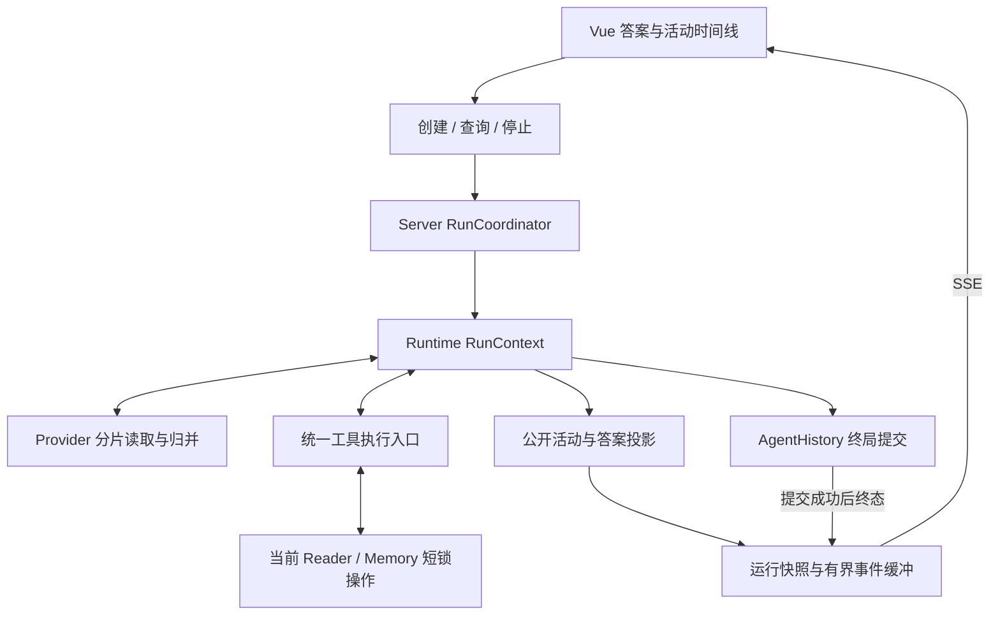

# Resident Agent 流式回答与运行活动切片方案

状态：架构已接受，2026-09-13；AS0–AS9 完成（Linux 实机验收于 2026-09-14 收口）。
决策：[ADR-0127](adr/0127-resident-agent-streaming-and-runtime-activity.md)。术语：[CONTEXT](../CONTEXT.md)。运行端口、协调器、事实活动、SSE、Provider 增量读取和答案草稿已实现；Reader 展示实时活动与逐步正文，最终完整编译和持久历史拥有定稿权。旧 `/agent/chat` 保留完整回合返回语义。

## 0 对齐与范围

**FrozenIntent**：让 Reader 中的 Resident Agent 在运行期间展示真实工具活动、逐步交付回答，并让阅读操作继续响应；保留来源编译、工具权限、阅读记忆与持久历史的权威。AS0 交付为 ADR、协议和可独立验收的切片方案，代码实施从 AS1 开始。

**TermMap**：

| 术语 | 状态 | 本方案含义 |
| --- | --- | --- |
| 住户 / Reader / 阅读记忆 | EXISTING | 单用户共享阅读器和原有持久状态 |
| 本轮证据账本 / 用户可见来源引用 / 回答来源属性 | EXISTING | 原文观察、来源绑定和公开文本的既有边界 |
| Agent 请求计划 / 模型运行时配置 | EXISTING | 每次采样的 Provider 无关输入和回合冻结配置 |
| Resident 运行 | NEW | 一条用户消息触发的完整工作过程 |
| Resident 运行活动 | NEW | 实际执行产生的可见活动及包含关系 |
| Agent 回答草稿 | NEW | 已通过展示规则、尚可替换的运行期内容 |

**RiskReceipt**：在已说明整轮全局锁、来源完整编译及一次修复、同步读取取消时延等取舍后，用户要求“那就落adr和切片方案”。据此接受前述架构并形成实施合同；性能数值仍需实测。

**ChangeType**：运行所有权与传输边界调整，加上增量展示能力。新术语已写入 CONTEXT，领域对齐完成。

当前产品边界为 Windows/Tauri 与 Linux 单用户 Reader；首版每个宿主最多一个活动 Resident 运行。工具决策、权限和证据规则沿用现有循环，确定性工具继续顺序执行；普通无来源回答仍然合法。保留现有 `/agent/chat` 的调用入口及完成结果语义。预构建与外部 MCP 访客继续使用各自生命周期。

## 1 当前代码与目标结构

下表保留 AS0 时的源码基线，作为目标对照；AS1–AS2 的当前实现与验证见本文末尾。

| 当前入口 | 当前行为 | 目标 |
| --- | --- | --- |
| [App.vue](../packages/web/src/App.vue)：`submitAgentMessage / latestTrace` | 等完整 outcome 后更新答案、轨迹、视口和历史 | 独立运行状态驱动增量界面 |
| [host.rs](../crates/server/src/host.rs)：HTTP worker 中的 `state.lock → route` | 四个普通 worker，Agent 整轮处于全局锁内 | 准备与提交短锁，运行与流写出独立 |
| [server lib](../crates/server/src/lib.rs)：`route_agent_chat / run_precommitted_agent_chat` | 预提交、画像处理、Runtime 和最终保存串行借用 AppState | 拆为准备、执行、提交 |
| [runtime lib](../crates/runtime/src/lib.rs)：`ModelAdapter / NativeAdapter / ReActAdapter` | 完整 JSON 响应，返回完整 AssistantTurn | 增量读取，同时归并完整语义结果 |
| [orchestrator](../crates/runtime/src/orchestrator.rs)：`dispatch_registered / execute_book_query / TraceStep` | 工具完成后汇总 trace；query/synthesize 内部含模型请求 | 开始/结束事件，内层调用带父步骤 |
| 同文件：`compile_agent_answer / deliver_agent_answer` | 全文编译，必要时一次隔离修复 | 有状态草稿投影，保留完整编译及修复 |
| [server lib](../crates/server/src/lib.rs)：`agent_source_binding` | 来源只从持久回合获取 | 活动已验证绑定与持久绑定接续 |



拟新增模块放在已有包内：Runtime 的 `run_context.rs / run_events.rs / answer_stream.rs / provider_stream.rs`；Server 的 `agent_run.rs / agent_stream.rs`；Web 的 `useAgentRun.ts / agent-run-state.ts` 与活动组件。以职责为准，可结合现有源码布局拆分文件；公开 Rust 类型仍通过项目的 ts-rs 流程生成 TypeScript。

## 2 运行所有权

`turn_id` 同时标识一次 Run，延续现有服务器分配方式，不增加另一套运行身份。运行固定 `book_id / session_id / turn_id`，模型请求或工具调用使用运行内 `step_id`；同一层级的归属由 `parent_step_id` 表达。

```text
prepare_turn(request)
  lock AppState
    校验输入和已验证选区
    固定目标书、会话、Provider 配置及原有权限
    precommit_agent_turn -> durable pending turn
    取得不可变 Book/成果资源、消息、画像及压缩输入
  unlock
  注册可查询运行 -> 启动执行

execute_turn(context, state_port, event_sink, cancellation)
  每次模型请求在锁外执行
  只读 Book/成果工具使用本轮固定资源
  Reader/Memory 工具通过 state_port 访问当前权威状态
  形成完整消息链、来源绑定、最终结果和运行摘要

commit_turn(turn_ref, completion)
  lock AppState
    按固定 session/turn 提交相应结果
    保留其他会话及运行期间的读者修改
  unlock
  发布已提交历史的最终投影
```

`RunContext` 拥有 messages、证据/定位/进展账本、暴露状态、预算和配置快照。Runtime 通过窄的状态端口读写 Reader/Memory、安装压缩检查点，不依赖 Server 类型。Book 等只读资源共享其现有生命周期，不在每次采样复制整本书。

所有含模型等待的路径适用同一边界：外层 chat、query 内层判断、synthesize 各批、selection answer、画像意图判断、上下文压缩、来源修复。需要可变状态的判断采用“读取输入 → 锁外判断 → 对当前状态应用具体结果”，沿用对应操作原有的前置条件。后台画像任务、读者手动操作与 Resident 不持有 MemoryStore 的相互覆盖副本。

开始前的选区和证据固定，`reader.state` 等实时工具读取执行时的当前视口。终局不把运行开始时的 Reader 快照写回。最终历史写入接收本轮 messages，不能再从可能已切换的全局 `state.messages` 推断归属；压缩检查点提交也绑定同一 session。

协调器先占用唯一运行槽，再准备回合；预提交失败释放槽，成功后同一槽一直归属本轮直到执行退出。活动运行存在时第二次发送返回 `AGENT_RUN_BUSY` 及当前 turn_id。新建/切换活动会话、切书或删除活动会话通过同一运行协调器先停止并收口，等待退出时释放 AppState 锁；只浏览历史不改变运行归属。前端按书、会话和 turn 消费事件。

现有后台画像 review 的活动记录、回合提交后协调与宿主退出通知，改由实际运行生命周期驱动。新 `/agent/runs` 与旧 `/agent/chat` 均只触发一次，不能继续只按旧 URL 识别 Resident 活动。

## 3 事件与展示契约

Provider 分片只描述线协议，Runtime 事件描述实际执行，公开投影决定哪些字段可以进入普通界面。三者使用明确类型，工具输出中的正文、控制字段和现有私有诊断遵守各自公开边界。

```text
RunDescriptor { book_id, session_id, turn_id }
RunEvent { turn_id, seq, elapsed_ms, step_id?, parent_step_id?, type, payload }
RunSnapshot {
  descriptor, last_seq, execution_state, persistence_state,
  messages, activities, effects, final_view?
}
```

| 事件 | 执行边界 | 主要载荷 |
| --- | --- | --- |
| `run.started` | pending 回合已持久化，开始处理 | 运行描述 |
| `model.started / model.finished` | 实际请求开始/结束，所有调用用途共用 | 用途、状态、耗时、实际或缺失用量 |
| `tool.preparing` | 已识别合法工具名，参数仍在接收 | 工具标签、准备状态 |
| `tool.started` | 完整参数经过现有检查，进入执行 | 工具名、公开参数摘要 |
| `tool.finished` | 返回、拒绝或取消待执行调用 | 状态、结果摘要、错误类别、耗时 |
| `answer.patch` | 增量展示投影产生可发布变更 | message_id、revision、append/replace/discard/finalize、公开内容 |
| `reader.changed / effect.created` | 对应操作实际成功 | 当前阅读状态的必要投影、effect_id、原有撤销信息 |
| `run.completed / run.failed / run.cancelled` | 对应终态持久化成功 | 已保存的历史投影与运行摘要 |
| `run.persistence_failed` | 终态写入失败，执行已停止 | 未保存状态与现有存储错误投影 |

`seq` 在单个运行内递增；`elapsed_ms` 使用运行起点的单调时间。工具状态区分 `preparing / running / succeeded / no_result / rejected / failed / cancelled`，按该工具实际结果判定；未执行的拒绝不能记为 started，也不编造执行耗时。

模型请求用途至少区分外层采样、query 内层、synthesize、selection answer、画像判断、压缩和来源修复。完整模型请求的工具参数尚未确认前，不提前 dispatch。Native 分片可提前呈现 preparing；ReAct 在结构化外壳已能确定前保持模型请求状态。

每个真实模型请求仅在其完成边界记录一次 usage，内层模型有自己的 step，父工具不再重复累计子请求。Provider 未提供用量时明确缺失；沿用的估算单独标记。新增完整请求成本与既有 `OuterOutcome.tokens_spent` 口径分列，首版不借计量调整原有预算停机策略。

活动摘要由注册工具的展示元数据和真实结果确定性生成。聊天活动与轨迹面板共享同一 reducer；诊断展开继续承载工具名、参数及 QueryAudit，普通视图使用可理解的标签、状态、范围和结果数量。既有 `TraceStep` 是完成摘要，新增字段对旧历史采用明确的“未记录”含义。

## 4 传输与快照

控制与订阅端点如下，浏览器继续经过现有 `/api` 前缀和同源认证入口：

| 接口 | 合同 |
| --- | --- |
| `POST /agent/runs` | 复用现有 chat 输入；预提交成功后返回 202 与 RunDescriptor，不等待模型 |
| `GET /agent/runs/{turn_id}` | 返回运行快照；已完成运行可由持久历史重建 |
| `GET /agent/runs/{turn_id}/events` | `text/event-stream`，事件 id 为该运行的 seq |
| `POST /agent/runs/{turn_id}/cancel` | 请求协作停止；重复取消已停止运行只返回当前状态 |
| `POST /agent/chat` | 进入同一运行核心，等待终局后返回原有 JSON/错误 |

已有 history 接口可发现 pending turn_id；创建响应丢失时读取当前会话与运行状态，不自动重新 POST 同一问题。订阅请求只观察已有运行，绝不创建运行。

```text
订阅创建 / 重连
  -> 在同一运行缓冲锁内确定 last_seq=N 并建立后续读取位置
  -> 游标仍在缓冲内：发送其后事件
  -> 首次订阅 / 游标过旧：发送 snapshot(N)
  -> 按顺序发送 seq>N 的新事件
```

重连使用 `Last-Event-ID`；新建 EventSource 需要从明确位置恢复时可使用 `after` 查询参数，两者同时存在以请求头的最新游标为准。`run.snapshot` 是观察重建消息，其 id 等于快照 last_seq，不制造新的业务事件。前端忽略已应用序号，结束事件后主动关闭订阅；连接 EOF 本身不表示运行成功。

每个运行保留按字节有界的事件环及当前投影。发生淘汰时落后订阅者取得快照；文本追加可合并，生命周期结果必须体现在快照中。正常终局快照可从历史重建，已结束运行的内存缓冲及时释放。活动快照的正文规模受原有输出/上下文预算约束。

HTTP 接单线程将 SSE 请求交给专用写出线程，运行线程只更新内存缓冲并通知订阅者；锁内不做 socket 写入。完整事件及时 flush，空闲期发送连接保活注释。保活只表示连接状态，不增加虚假的 Agent 活动。

继续使用锁定版本 tiny_http 0.12 与 ureq 2.12 的流读写能力。tiny_http 当前普通 Response 路径不能靠最终 flush 达到实时输出，需要专门验证流式写出的事件边界。现有 [Nginx 示例](../scripts/linux/nginx-reader.conf.example) 已有 `proxy_buffering off` 和长读超时；Windows/WebView2 与 Linux 实际入口分别验收。

## 5 模型分片与回答交付

适配器扩展为“增量观察 + 完整结果返回”的双输出；原有控制循环始终得到完整 AssistantTurn 或完整结构化结果。公共 `book.*` 工具结果 schema 保持，分片不是其新的工具返回类型。

```text
model_request(plan, model_sink, cancellation) -> CompleteModelResult
  SSE 字节读取 -> UTF-8/帧解析 -> text/tool_arguments/usage/finish 归并
  完整工具调用 -> 既有校验与执行
  可公开文本候选 -> AnswerProjector

AnswerProjector.push(delta, bindings, provenance) -> AnswerPatch[]
AnswerProjector.finish() -> 完整候选 -> deliver_agent_answer
```

Provider parser 处理普通中文的跨网络字节分片、多个事件合并到一次读取、跨行 data、工具参数分片和供应商结束约定。只在明确完成后确认工具调用；截断 EOF、无合法终结、解析错误不能伪装成正常完成。部分输出后发生重试时，新的模型请求使用新 step 和草稿 revision；先替换或撤回旧草稿，禁止把两次尝试串成同一答案，也不能重新执行已经完成的工具。

Native 和 ReAct 都覆盖 `chat`、内层 `complete`、`complete_structured`。ReAct 结构化外壳、内层工具 JSON、画像/压缩结果由内部归并器消费，普通界面只得到活动状态；已识别的最终自然答案字段可进入 AnswerProjector。选区强制收敛使用的结构化答案路径也必须接入，不能只改普通 chat。

| 内容 | 增量策略 |
| --- | --- |
| 普通正文 | 以完整句段为首版发布边界，再逐步输出能确定安全的稳定前缀 |
| 来源标记、代码/引用结构、位置表达的未决尾部 | 缓冲并保留跨片段状态，不独立扫描每个 delta |
| 工具参数、内部结构化结果、Provider 推理字段 | 保留在内部协议/活动层 |
| 一次采样先有文本、后请求工具 | 将该 message 定为过程消息，不能拼入最终答案 |
| 完整来源编译失败 | 原有一次修复，替换对应草稿；修复失败发布原有规范失败结果 |

增量投影复用现有来源和出处判定，保持跨段的必要状态；对于尚不能判定的尾部继续等待。新增检验用不同合法分片切分同一输入，要求终局与完整编译等价，且任何已发布片段都满足公开规则。不能仅凭“这段目前看起来正常”宣布前缀稳定。

`answer.patch` 的 message_id 对应一次采样输出；revision 隔离原候选与修复候选。append 只补当前 revision，replace 原子替换同一消息的草稿，discard 撤回当前候选，finalize 安装已提交的规范视图。前端每帧合并正文更新，已完成块保持稳定，只重渲染活动尾部。

草稿通过展示检查仍不代表任务完整完成；后续可能进入工具调用或整体修复。它不提前成为成功的 Provider 历史消息，也不驱动已完成回合的画像归纳。

## 6 终态与持久化

```text
preparing -> running -> finalizing -> completed | failed
                  \-> cancelling -> finalizing -> cancelled
finalizing 写入失败 -> execution ended + persistence failed
进程重启遗留 pending -> failed(INTERRUPTED)
```

`completed` 保留 `outcome.incomplete`，界面分别显示完成与未完成。正常终态由已保存的 AgentChatTurnView 生成，不直接转发尚未提交的 Runtime outcome。准备失败、执行失败和提交失败分别保持原有错误类别。

持久结构扩展集中在现有 AgentChatTurn：保存与成功 outcome 独立的运行摘要，包含步骤终态、耗时、已发生 effects 和必要错误投影，使失败、取消也可回看。旧 completed/failed/pending 记录沿用既有读取逻辑；新摘要缺失表示历史未记录，不从正文推断耗时或工具开始时间。取消增加明确的历史状态，并更新会话校验、画像 review 选择和前端显示。

原始分片、未提交草稿和逐 token 事件仅在活动内存中。已执行的 Reader/Memory 写入沿用原持久路径；运行失败或取消不批量撤销。已经展示的草稿可在当前界面标记为未完成，重新打开历史时以持久终态和摘要为准。

若最终写入失败，发出 `run.persistence_failed`，停止等待动画并标为未保存；保留可查询的未保存快照，不发送 completed/failed/cancelled 的持久确认。重启后按磁盘中仍存在的 pending 进行中断恢复。该错误不触发模型重跑。

重启恢复只在宿主恢复阶段把上次进程留下的 pending 提交为中断。`GET /agent/history` 继续是只读投影，不能因读历史修改当前进程正在运行的回合；存储失败沿用既有明确诊断。

取消令牌到达后不再发起下一次模型请求或工具调用，也不为被取消候选调用来源修复。正在执行的短状态修改完成后报告真实结果；网络等待遵守明确请求超时与可用的分片边界，只有实际退出才显示 cancelled。宿主停机、用户取消、切书和会话删除通过同一协调器收口。

来源发布先登记本轮已验证 SourceBinding，再发出带标签的公开引用；现有 resolve/open 根据 turn_id 读取活动绑定，终局后读取持久绑定。修复撤回的草稿引用随投影移除，最后仅提交最终已用绑定。诊断信息沿用现有私有存储边界。

Reader 状态事件在真实动作完成后发出。导航、高亮、笔记、布局和小地图遵循各自当前保存与 effect 语义；`with_goto` 等终局聚合仍负责原来的撤销基准。实时状态同步不能导致最后再执行一次动作或重复生成撤销卡。共享阅读状态更新使用单调 revision，在前端忽略比已应用状态更旧的运行事件；该 revision 仅用于本次并行交互排序。

## 7 切片顺序与状态

原架构的四个阶段细分如下。AS2 提前实现生命周期基础，避免后续开放流式接口时暂时失去切书与停止的约束。

| 阶段 | 切片 | 类型与交付 | 状态 |
| --- | --- | --- | --- |
| 文档 | AS0 | ADR、术语、协议、切片与架构索引 | 完成 |
| 运行与共享状态 | AS1 | 纯结构调整：RunContext 与状态端口 | 完成 |
| 运行与共享状态 | AS2 | 独立 RunCoordinator、短锁、持久终态与协作停止 | 完成 |
| 事件和时间线 | AS3 | Runtime 事件、步骤包含关系与运行摘要 | 完成 |
| 事件和时间线 | AS4 | 创建/查询/取消接口、SSE、快照接续 | 完成 |
| 事件和时间线 | AS5 | 前端实时活动与共享状态归并 | 完成 |
| 模型与正文流式 | AS6 | Provider 流读、分片归并与请求计量 | 未开始 |
| 模型与正文流式 | AS7 | 增量答案投影、修复替换和最终定稿 | 未开始 |
| 阅读动作与完整验收 | AS8 | 活动来源和即时 Reader/effect 同步 | 未开始 |
| 阅读动作与完整验收 | AS9 | Windows/Linux 端到端验收与延迟分解 | 未开始 |

```text
AS0 -> AS1 -> AS2 -> AS3 -> AS4 -> AS5 -> AS6 -> AS7 -> AS8 -> AS9
```

切片串行推进，共享 orchestrator/Server 的调整逐刀提交到可验证状态。AS5 可作为“实时工具活动”的阶段性交付，AS7 形成正文流式候选，AS9 才完成本方案整体验收。阶段交付需明确所覆盖范围。

## AS0 文档与索引

**输入 → 输出**：当前源码与已接受架构 → ADR-0127、本文、CONTEXT 新术语、架构待实施索引和代码链路记录。
**完成判据**：新链接和章节可达、现有源码符号可定位、AS0–AS9 无缺号、ADR 决策块精简且未把计划写成生产事实。
**验证**：仅做本轮文档差异、链接、编号和引用定位检查，结果写在本文末尾。

## AS1 运行端口拆分

**输入 → 输出**：当前直接借用 AppState 各字段的 Runtime 入口 → 独立 RunContext、Reader/Memory 状态端口和会话提交参数。
**触达**：[orchestrator](../crates/runtime/src/orchestrator.rs) 的 `run_with_turn_resources_and_checkpoint_sink / dispatch_registered`；[Server](../crates/server/src/lib.rs) 的 `run_precommitted_agent_chat / install_agent_compaction_checkpoint / finalize_agent_turn`；拟新增 Runtime `run_context.rs`。
**做**：把长期运行数据与共享可变状态访问拆开；书和成果使用只读资源，消息/检查点提交明确接收 session/turn。此刀仍由原同步入口调用，新端口暂由已借用状态实现，保留原有锁行为和返回值。
**边界**：本刀只改变结构；不开放运行接口、不发送事件、不改模型协议或阅读动作行为。
**完成判据**：既有相同输入与脚本化模型返回得到相同 outcome、工具顺序、持久消息、来源和 effects；后续宿主可在不修改循环算法的情况下实现短锁端口。
**验证**：先跑并保持现有 Runtime/Server 定向测试；有未覆盖行为时先补特征测试。尤其覆盖压缩检查点、失败终态与显式导航，发现差异就留在 AS1 修复。

## AS2 独立运行与生命周期

**输入 → 输出**：AS1 的状态端口 → 宿主 RunCoordinator、单活动运行、锁外模型等待和可持久的完成/失败/取消。
**触达**：[host](../crates/server/src/host.rs)、[host_lifecycle](../crates/server/src/host_lifecycle.rs)、Server 的 `precommit_agent_turn / finalize_agent_turn / AgentChatTurn / AgentAssistantStatus`、[memory review](../crates/memory/src/review.rs)；拟新增 Server `agent_run.rs`。
**做**：实现 prepare/execute/commit；准备阶段也将画像判断等模型等待拆出锁外；添加协作取消与固定归属，统一新建/切会话/切书/删除/停机边界和画像 review 活动通知；历史增加独立运行摘要承载位置与取消状态。启动恢复遗留 pending，不在 GET 中写入。
**完成判据**：模型等待期间 Reader 请求可完成；并发读者写入不被终局覆盖；第二运行被拒绝；取消后零后续采样/工具；已完成动作仍在；错误回合与取消回合有正确终态。取消回合不被画像层误当成功回答。
**验证**：用本地脚本化 HTTP Provider 卡住响应，真实宿主并发发出 Reader/Memory 请求；真实临时持久目录验证提交失败、进程重启中断、会话归属和既有历史 fixture。用同步信号确定先后，不靠毫秒阈值猜执行顺序。
**回退条件**：仍有模型路径持全局锁、旧消息回写覆盖状态、或退出前释放运行归属，均回到此刀修复后再进入 AS3。

## AS3 运行事件与步骤树

**输入 → 输出**：可独立运行的循环 → 类型化 Runtime 事件、公开活动投影和同源最终摘要。
**触达**：Runtime 的模型调用边界、`dispatch_registered / execute_book_query / query_run / synthesize / deliver_agent_answer / TraceStep`；[agent_request_audit](../crates/runtime/src/agent_request_audit.rs)；Server RunCoordinator；拟新增 `run_events.rs`。
**做**：在真实开始/结束处记录步骤；内层模型继承父工具，画像/压缩/修复注明用途；投影工具标签、结果和耗时；失败前已有步骤独立于成功 outcome 保存。
**完成判据**：执行中可观察 started，返回才出现 finished；被拒绝调用不出现 started；内层模型归属正确；父工具与子模型的用量不重复累计；活动投影与持久摘要相符。
**验证**：使用事件收集器与有同步信号的模型响应检查顺序、父子关系、错误、无结果和取消路径；现有 QueryAudit/来源私有诊断回归继续通过。此刀不依赖 HTTP 流式即可判定事件事实。

## AS4 运行 API 与 SSE

**输入 → 输出**：RunCoordinator 和运行事件 → §4 的接口、按字节有界的缓冲及快照接续。
**触达**：Server `host.rs / agent_run.rs`；拟新增 `agent_stream.rs`；[api.ts](../packages/web/src/api.ts) 仅补协议类型或流客户端基础；既有 `/agent/chat` 调用同一核心。
**做**：创建快速返回；GET 订阅复用已接受运行；专用线程持续写出并 flush；处理 Last-Event-ID、首次快照、过旧游标、慢订阅者、终态关闭和取消接口。
**完成判据**：模型尚未完成时 HTTP 客户端已读到事件；四个普通 worker 不被流连接占满；同一运行断线后工具执行次数不增加；淘汰后快照与连续消费结果等价；提交失败只发未保存故障。
**验证**：真实 TCP/HTTP 集成测试分阶段发送与接收，覆盖首次订阅晚于启动、快照与新事件衔接、缓冲淘汰、慢读者和断线。若只有连接结束才读到消息，修流写出而不是前端加动画。

## AS5 前端实时活动

**输入 → 输出**：SSE 契约 → 当前消息旁的活动摘要、共享轨迹时间线、真实运行/连接/停止状态。
**触达**：[App.vue](../packages/web/src/App.vue) 的 `submitAgentMessage / latestTrace`、[RightRail.vue](../packages/web/src/components/RightRail.vue)、api.ts；拟新增 `useAgentRun.ts / agent-run-state.ts` 与活动组件。
**做**：把 sending 与 outcome-only 状态拆成运行状态；聊天区和轨迹面板共用 reducer；支持 snapshot、去重、重连、取消、失败摘要和未保存提示；历史浏览保留正在运行的归属。
**完成判据**：模型结束前工具卡已显示真实运行状态；切换轨迹标签仍显示同一记录；重连不重复卡片，失败/取消停止等待动画；用户上翻时不强制跳到底部；重新打开历史显示保存摘要。
**验证**：reducer 定向测试、Vue 组件测试和 Playwright + 真实服务的受控 Provider。当前答案仍可整体定稿，此阶段明确交付实时活动能力。

## AS6 Provider 增量读取与完整归并

**输入 → 输出**：现有 Native/ReAct 完整响应 → 流读事件和等价的完整语义结果。
**触达**：[runtime lib](../crates/runtime/src/lib.rs) 的 `ModelAdapter / NativeAdapter / ReActAdapter / AssistantTurn`；[model_runtime](../crates/runtime/src/model_runtime.rs) 请求计划；host_lifecycle 的 ServiceAdapter；拟新增 `provider_stream.rs`。
**做**：补 Provider SSE 帧解析、文本/工具参数归并、结束原因、请求级 usage 和取消观察；覆盖 chat、complete、complete_structured 以及生产包装适配器。已支持的非流式路径返回明确完整结果，不在收到部分输出后偷偷切换重跑。
**完成判据**：中文及来源标记在任意普通网络分片下无乱码/丢失，工具 ID/索引/参数归并正确；完整参数校验前零工具执行；正常 EOF 与截断可区分；usage 每请求记录一次；包装适配器不吞增量或取消。
**验证**：本地 HTTP Provider 发送带工具调用、空内容帧、最终 usage、截断和跨字节片段的真实流；比较相同语义脚本的流式与完整结果。Native/ReAct 均验证工具协议与停机语义。

## AS7 增量答案与最终交付

**输入 → 输出**：AS6 文本分片及当前来源/出处账本 → 可追加、替换和最终定稿的 AgentAnswerView 草稿。
**触达**：orchestrator 的 `compile_agent_answer / deliver_agent_answer / parse_source_marker` 及选区收敛路径；拟新增 `answer_stream.rs`；前端答案 reducer 与 RightRail 渲染。
**做**：共享编译规则的有状态前缀处理；完整句段增量发布；分别管理过程消息、最终候选和修复 revision；最终完整编译、持久化后安装规范视图。保留既有一次来源修复额度和无来源回答行为。
**完成判据**：响应结束前出现真实正文；跨分片标记和出处约束无漏检；普通列表、版本、代码、原文数字不被误删；最终回答与重新读取历史一致；修复替换草稿，不串接两个候选。取消时不再修复。
**验证**：复用 `source_presentation_ / answer_provenance_ / answer_delivery_` 回归；同一输入做多种分片，检查发布内容与完整编译等价；覆盖 Native/ReAct、选区结构化答案、文字后工具调用、修复失败和存储失败。前端断言正文先于 Provider 终结出现。

## AS8 活动来源与即时阅读动作

**输入 → 输出**：增量回答及 Runtime 活动 → 运行期可用的来源和实际动作同步。
**触达**：Server `agent_source_binding / route_agent_source_resolve / route_agent_source_open`、Runtime `source.present / with_goto` 及 Reader effect 边界；App.vue 视口同步和 RightRail 来源交互；[agent-source.spec.ts](../packages/web/playwright/agent-source.spec.ts)。
**做**：在发布引用前登记已验证绑定，终局切到持久绑定；真实 Reader 修改后发布必要状态及 effect，使用稳定 effect_id 与阅读状态 revision 去重和排序；保留原有终局撤销语义。
**完成判据**：生成期间已发布来源可解析/打开；修复撤回后当前草稿不残留旧来源；终局后引用继续有效；正文、笔记、高亮和布局只执行一次；较旧事件不覆盖手动阅读的新状态；切书后旧事件不改变新书。
**验证**：真实 Reader/Memory 存储与活动来源集成测试；扩展来源 Playwright 场景并验证最终 effect/持久状态。成功 Reader 动作与失败回合组合时，动作记录仍可见。

## AS9 完整链路与延迟分解

**输入 → 输出**：AS1–AS8 固定源码状态 → Windows/WebView2、Linux 代理路径的端到端结果和新的运行记录。
**触达**：现有 Runtime/Server/Web 测试、[Playwright 配置](../packages/web/playwright.config.ts)、[agent-run](../evals/semantic/agent-run.mjs)、[Nginx 示例](../scripts/linux/nginx-reader.conf.example) 和 [Linux 部署说明](Linux阅读器部署.md)。结果写入新的 `docs/agent-streaming-validation.md`（实施时创建）。
**做**：真实模型验证一条含检索/来源的问答、一条选区回答和一条显式阅读动作；受控模型验证重连、取消、长等待和提交失败。相同题目/模型/配置比较原有完整入口与新流式入口，不更改工具预算。
**完成判据**：两个宿主均能在 Provider 结束前显示正文和工具活动；运行中 Reader 可操作；断线恢复无重复执行；来源及历史一致；取消与宿主停止正确收口；旧 `/agent/chat` 和评测入口仍可用。
**验证**：按已改路径运行 Rust 定向测试、Web `test / typecheck / build` 与相关 Playwright；跨模块接入完成后跑受影响测试集合。真实样本保存实际结果、失败和缺失计量，不用动画时长或模型自评分代替到达时间。
**失败处理**：事件未及时到达回到 AS4；没有早于终结的正文回到 AS6/AS7；来源或动作重复回到 AS8；锁阻塞/终态问题回到 AS2。没有对应新失败时不反复扩大审查。

## 8 验收测量

分别记录以下观测点：用户提交到运行接收、运行开始到首条活动、每次模型请求到首个 Provider 分片、运行开始到首段可见正文、完整终局时间、运行期间 Reader 请求响应、各工具与嵌套模型耗时。同步记录请求数、实际/估算/缺失 usage。

确定性验收优先证明顺序：模型响应仍被夹具控制在未完成状态时，客户端已经收到活动/正文，且 Reader 请求已完成。真实模型样本报告实际值；流式首字和总耗时分列，模型请求用途及次数解释总等待，不把提前出现连接确认算作提前回答。

每个实施切片只运行能发现对应失败并决定下一步修法的检查；新增执行路径用最小有意义测试，存储行为使用真实临时目录。每刀完成更新本表、[代码链路](代码链路.md) 和已实现架构；源码或行为未变化时不重复跑同一套检查。

## 9 已知限制

- AS1–AS8 已交付独立运行、事实活动、SSE、观察恢复、停止、正文草稿、活动来源及即时动作同步。
- Windows Chromium、Tauri/WebView2 与 Linux Nginx 路径均已完成验收；实际测量与环境边界见 AS9 验收记录。
- 流式减少可见等待，不自动减少模型请求数或总执行时间；单样本真实到达时间见 AS9 验收记录，不据此推断稳定总耗时收益。
- 第一版句段发布存在必要缓冲；不完整语法和未决出处表达可能继续等待，完整编译仍可能替换草稿。
- 同步网络读取下取消是协作式，受在途读取和请求超时约束；停止请求与实际退出分别显示。
- 事件缓冲用于当前进程恢复观察；原始分片和未提交草稿不跨进程恢复，重启后不自动续跑工具。

## 10 协议资料

- [WHATWG SSE 标准](https://html.spec.whatwg.org/multipage/server-sent-events.html)：事件 ID、Last-Event-ID、事件帧与连接重建，2026-09-13 查阅。
- [DeepSeek Chat Completions](https://api-docs.deepseek.com/api/create-chat-completion/)：文本与工具调用分片、finish 和 usage；不同兼容端点按各自完成协议归并，2026-09-13 查阅。
- 本地依赖依据 [Cargo.lock](../Cargo.lock) 的 tiny_http 0.12.0 / ureq 2.12.1；实际流式 flush 与超时行为由 AS4/AS6 的 TCP 集成测试判定。

## 11 文档验证记录

2026-09-13：本轮五个文件的新增内容中，43 处本地链接及其中 6 处章节锚点可达，28 个既有源码符号可定位；ADR 六条决策均不超过 30 字、各块不超过 15 行，AS0–AS9 编号与待实施状态完整。新增内容无行尾空白，代码围栏闭合。两处外部协议链接复用架构讨论时已查阅的原始资料。

本轮仅修改 Markdown 文档；未运行生产功能测试、真实模型或性能测试。后续实现与验收状态按各切片更新。

## AS1 实施验证

2026-09-13：新增 `RunContext` 持有本轮消息、配置与证据/定位/进展/暴露账本；`ResidentStatePort` 将确定性 Reader/Memory 操作与 Book 模型调用拆开。同步入口通过 `BorrowedResidentState` 调用相同循环，终局提交显式接收本轮 messages。

基线 Runtime orchestrator 123 通过、3 原有忽略；Server agent 定向 29 通过。结构调整后 Runtime 同组 123 通过、3 忽略，Server lib 241 通过，包含压缩、失败终态、来源与导航。

## AS2 实施与验证

2026-09-13：`RunCoordinator` 在预提交之前保留单一运行槽，固定 book/session/turn；`PreparedAgentChat` 持有共享 `Arc<Book>`、本轮消息及已验证选区。同步调用和 HTTP 宿主消费同一 `execute_prepared -> run_precommitted_agent_chat -> run_context` 核心。Reader/Memory 使用当前权威实例，Book 查询、综合、画像判断、压缩与来源修复在共享状态操作之外等待模型。

`CancellationToken` 覆盖外层与内层模型调用、完整工具批次之间的停止边界，并传入 Native/ReAct 的 HTTP 重试。取消保留已完成动作；未执行的批次后缀只补取消回执以闭合 Provider 消息协议，不增加工具执行或轨迹。导航只汇总本轮真实动作，以第一次 Agent 导航前的当前 anchor 作为撤销基准，手动翻页不生成 Agent effect。

完成、失败、取消均按固定 session/turn 和显式 messages 提交；独立 `run_summary` 保存 effects/trace，旧历史缺失时仍为 None。提交失败保留 durable pending 与协调器最新 `UnsavedRun`，不重跑模型；宿主启动恢复 pending 为 `failed(INTERRUPTED)`，GET 继续只读。新建/选择会话、切书、删除活动会话和停机共用协调器，等待退出时不占 AppState 锁。删除其他会话可在运行期间完成且不会被终局回写恢复。画像 review 按真实运行开始/退出更新活动状态，取消输入使用独立 `ReviewTurnStatus::Cancelled`。

| 验证 | 结果与范围 |
| --- | --- |
| Runtime lib 全量 | 319 通过、3 原有忽略；含原有来源/压缩/选区/导航及新增 Native/ReAct 取消后断线不重试。 |
| Server lib 全量 | 251 通过；原有 241 条与首批 10 条真实宿主测试全绿。 |
| 最后增量后的宿主定向 | 12 通过；增加部分批次取消后续聊、运行期间删除其他会话，重新覆盖全部 AS2 宿主场景。 |
| Web 类型检查 | `npm run typecheck` 通过，历史合同增加 cancelled 与可选 run_summary。 |
| Rust Server 编译检查 | `cargo check -p server --tests` 通过；共享 Book 入口及现有调用者可编译。 |

宿主夹具使用真实临时 Memory/History 目录和本地 HTTP Provider，以通道扣住模型响应，再验证 Reader 请求、手动笔记/导航、第二运行拒绝、取消后零后续工具/采样、画像判断、内层综合、来源修复、新建/切会话/切书/删除/停机、预提交失败、终局写入失败和启动恢复。时间上限仅用于检测测试死锁，未声称真实模型延迟或性能改善数值。原有 ts-rs serde 属性解析警告不影响本次测试。

## AS3 实施与验证

2026-09-13：`run_events.rs` 为实际模型请求与工具操作分配步骤，记录用途、父工具、状态、耗时和可用 usage；公开活动只含注册标签、数量及错误码，不包含模型正文、参数或 QueryAudit。画像、压缩、选区、query、synthesize 和修复使用明确用途；运行失败及取消保留独立活动摘要。旧历史缺失 activities 时表示未记录。

Runtime lib 322 通过、3 原有忽略；宿主定向 12 通过。通道夹具证明 started 先于响应放行、结束只记录一次，拒绝不产生启动和耗时，内层综合归属于父工具，取消仍记录已返回的外层 usage。旧 complete/complete_structured 接口未提供 usage，记录为缺失；Provider 分片及完整请求计量在 AS6 实施。

## AS4 实施与验证

2026-09-13：宿主提供创建、查询、取消、SSE 接口，旧 `/agent/chat` 共用 reserve/execute。`RunStream` 在同一锁内更新快照、递增序号并维护 256 KiB 事件环；首次或过旧游标回快照，正常重连回连续事件。已保存回合按历史重建，最新未保存结果独立保留。tiny_http `into_writer` 在专用线程显式写出并 flush，运行线程不等待网络。

Server lib 256 通过。真实 TCP 测试证明模型未结束时收到活动、5 个订阅不占满普通 worker、Last-Event-ID 优先、重连零新增执行、终态快照与持久摘要相符；取消和保存失败分别发出正确终态。有界缓冲测试验证淘汰后的完整快照与后续序号接续。

## AS5 实施与验证

2026-09-13：`agent-run-state.ts` 归并快照和递增事件，按运行身份及步骤去重；`useAgentRun.ts` 管理订阅、断线恢复、取消与明确终态。App 从历史 pending 恢复观察，创建响应丢失时查询历史；问答与轨迹共用 `AgentActivities`，展示父子步骤、真实状态、耗时及缺失用量。失败、取消和未保存分别收口，用户上翻时保留位置。当前回合存在活动时，诊断列表也只取当前回合，空诊断不回退到上一轮。

刷新停止问题已定位并修正：`usage.event` 在全局状态锁内等待 metrics Core，其他阅读请求占住普通 worker 后，停止请求排队。现改为锁内固定书籍、计划和存储目录输入，锁外等待 Core；沿用实际用量写入和既有校验。Playwright 通过 Node 预加载模块扣住真实 metrics 子进程，模型同时保持未完成，证明阅读状态和停止响应均在放行前返回；用量子进程不是替身。夹具为书、历史、记忆和预构建私有存储分别使用同一临时根目录下的独立目录。

| 验证 | 结果与范围 |
| --- | --- |
| Server lib 全量 | 257 通过，覆盖事件/SSE、来源拒绝不启动不计耗时、取消/未保存、会话归属和原有真实用量持久化。日志：`tmp/as5-server-tests.log`。 |
| Web reducer/订阅/RightRail | 18 通过，覆盖去重、归属、终态、重连、停止和上翻位置。日志：`tmp/as5-web-tests.log`。 |
| Web 类型检查与生产构建 | `npm run build` 通过（含 `vue-tsc --noEmit`）。日志：`tmp/as5-web-final-build.log`。 |
| Playwright + 真实宿主 | 1 个完整场景通过：内层综合结束前已有父子活动；刷新不新增采样；问答/轨迹同源；metrics 等待期间阅读/停止可响应；取消历史、后续发送与完成历史恢复；新轮诊断不混入旧轮；Provider 空响应失败后结束等待并可重开历史。日志：`tmp/as5-final-browser.log`。 |

失败复现分别记录于 `tmp/as5-metrics-red2.log`（锁内等待导致 Reader 超时）与 `tmp/as5-trace-red3.log`（新轮仍出现两条旧诊断）。最终浏览器夹具使用隔离私有目录；时间上限只检测未收口，不作为性能收益数据。现有 ts-rs 属性与 Web chunk 大小提示未阻断构建。

## AS6 实施与验证

Native/ReAct 的 chat、complete、complete_structured 均请求 SSE，逐帧观察并归并完整语义结果；普通 JSON 响应沿用完整解析。ModelObserver 只传递线协议事实，工具执行仍等待完整返回与既有检查。传输重试只发生在响应接收前；已收到响应后的截断、非法 JSON 或缺失合法 finish 直接失败，不自动重跑。

真实本地 HTTP 夹具覆盖两种协议×三个入口、中文逐字节写入、多帧读取、跨行 data、最终 usage；参数按工具 index 归并并在合法终结后解析。usage 每请求只发布一次；ReAct 使用 Provider 请求 usage。取消在读取前后检查，同步在途读取仍受既有超时约束。

定向 2 通过；接入后 Runtime lib 324 通过、3 原有忽略。日志：`tmp/as6-provider-tests.log`、`tmp/as67-runtime-tests.log`。

## AS7 实施与验证

`answer_stream.rs` 按每次采样分配 message_id；Runtime 对外层、工具预算终答及选区强制收敛安装 AnswerProjector。普通文本保留跨分片尾部，只在句段边界调用既有完整来源/出处编译器；ReAct 和选区 JSON 仅解码顶层 final/answer 字符串，工具参数、推理和内部结构结果不进入正文。

普通正文增长发 append，来源结构变化发 replace；Server 与 Web 归并成完整快照。工具候选撤回，来源修复沿用一次额度并递增 revision 替换旧草稿。最终全文仍由 deliver_agent_answer 编译；历史提交后发送 finalize，失败、取消或保存失败发送 discard。持久 last_seq 包含最终草稿事件与运行终态。取消后的已返回 usage 保留，内层 completion 的实际 usage 独立记在模型步骤，父工具不重复累计。

前端按显示帧合并正文更新，保留未变化的已完成渲染块。刷新从快照恢复完整草稿；终态安装已保存的规范历史视图，草稿不写入成功历史或画像输入。

| 验证 | 结果与范围 |
| --- | --- |
| Runtime lib 全量 | 327 通过、3 原有忽略；含原有来源、出处、一次修复、选区、工具和取消回归。`tmp/as67-final-rust-tests.log`。 |
| 最终草稿/选区定向 | 4 通过；多种分片、来源与出处、列表/版本/代码、JSON 转义、工具候选撤回、修复 revision，以及选区强制收敛在完整结构化返回前发布正文。`tmp/as7-projector-final.log`。 |
| Server lib 全量 | 258 通过；快照、提交后定稿、取消/保存失败撤回、真实用量与原有历史/来源路径。`tmp/as67-final-rust-tests.log`。 |
| 最终 Server Agent 定向 | 46 通过；追加归并、快照/修复、提交边界、持久序号及真实宿主回归。`tmp/as7-server-final.log`。 |
| Web 定向 | 21 通过；追加/替换/撤回、revision、快照、帧合并、终态和组件。`tmp/as7-web-tests.log`。 |
| 构建 | Server 可执行文件与 Web 类型检查/生产构建通过。`tmp/as7-server-build.log`、`tmp/as7-web-build.log`。 |
| 最终真实宿主浏览器 | Native/ReAct 两项完整场景通过；未结束 Provider 前真实正文、追加与刷新零重跑、不完整参数零执行、文字后工具、停止、来源修复替换、历史重读、失败恢复。`tmp/as7-browser-final.log`。 |

最终浏览器使用真实 tiny_http、隔离临时书/Memory/History 与受控 HTTP Provider；测试的同步顺序证明提前到达，不作为真实模型延迟测量。首次 Server 回归中的旧内层 usage 断言已按 AS6 更新，取消实际 usage 丢失及草稿事件先于模型开始的顺序问题已修正；ReAct 空响应沿用 PROVIDER_ERROR，Native 空文本沿用 PROVIDER_EMPTY_RESPONSE。

## AS8 实施与验证

2026-09-13：AnswerProjector 在引用发布前把已验证绑定登记到 RunStream 私有存储；Server 仅解析当前书籍、回合和当前草稿实际发布的引用。修复 replace/discard 撤回旧引用，历史提交后由持久绑定接续。私有 EvidenceRange 不进入公开快照。RightRail 草稿沿用来源弹窗，撤回时关闭已失效弹窗。

Reader 在导航、笔记、高亮、布局及地图写入时推进进程内 revision；RuntimeStatePort 在实际修改边界发布 reader.changed，工具成功 effect 使用 turn_id/step_id 生成稳定事件身份。快照保留状态和实际 effects，取消或失败后仍可见；终局撤销继续使用原聚合 effects。前端只同步观察、不重放写入，按来源书、会话、revision、effect_id 归并；刷新时读取当前 Reader 确认状态，手动视口操作建立当前 revision 边界，过时事件不再定位正文。终局不强制重置视口。

Server Agent 定向 47 项、Web reducer/订阅/组件 22 项通过；Chromium Native/ReAct 两场景通过生成期间来源打开、刷新零重跑、即时笔记、终局来源和已有流式/取消/修复场景。AS9 扩展后的 Reader 54、Runtime 328（3 原有忽略）、Server 259 项通过。日志见 `tmp/as8-server-tests.log`、`tmp/as8-web-tests.log`、`tmp/as8-browser-final.log`、`tmp/as9-rust-tests.log`。AS9 实机与真实模型结果见 [验收记录](agent-streaming-validation.md)。

## AS9 实施与验证

2026-09-14：Windows Chromium、真实 Tauri/WebView2、Linux release server 经 Nginx 的 Native/ReAct 场景完成；三个环境各覆盖正文提前、活动、恢复、来源、即时动作与终态。Linux 另有 15 项真实宿主生命周期测试通过，含取消、保存失败、切书、停止和中断恢复。

Windows 与 Linux 各完成三题×两入口的真实 `deepseek-v4-flash` 样本；流式首正文均早于 Provider 最后结束，来源与历史一致，usage 有实际记录。跨主机浏览器沿现有代理配置建立隔离 loopback 实例，正式服务未切换。单样本及工具选择差异不用于宣称稳定总耗时收益。

详细数据、测量口径和失败记录见 [验收报告](agent-streaming-validation.md) 与 [机器可读结果](agent-streaming-validation.json)。Linux 构建、浏览器及生命周期日志在 `tmp/as9-linux`；远端独立源码与日志在 `/opt/understand-book/acceptance/as9-20260914`。
