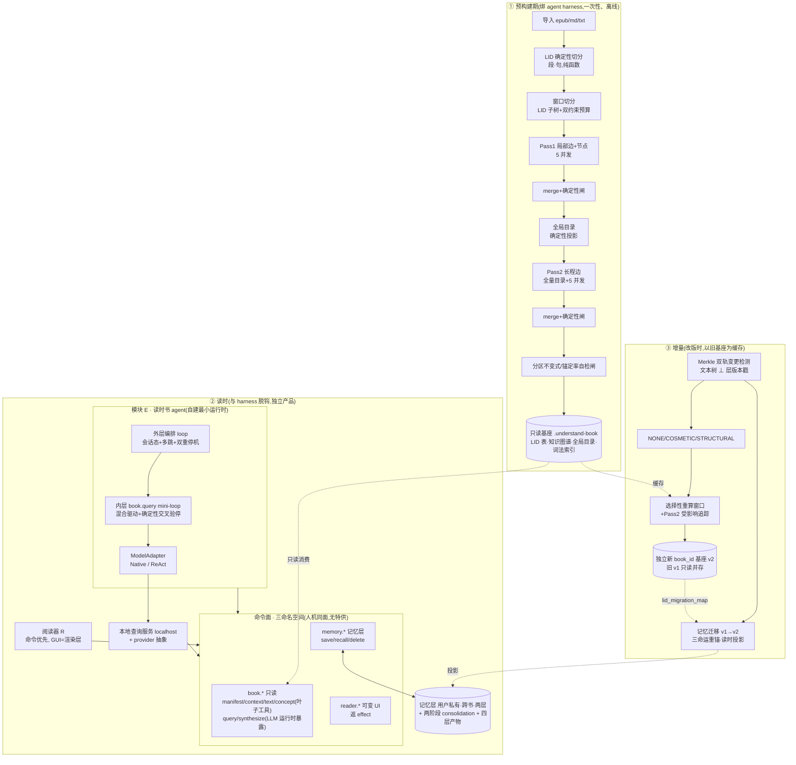

# 技术方案 · 整体架构蓝图

> **定位**:本文是**架构视图**——把分散在 20 条 ADR 的决策汇成一张连贯的「系统怎么搭」蓝图,给没逐条读过 ADR 的工程读者画地图。
> **不是什么**:不复述 `需求文档-V3.md` 的契约细节(命令签名/字段/枚举去 V3 §4),不下沉到实现级数据结构与伪代码(留实现设计)。
> **用法**:每个组件/机制后挂 `[ADR-N]` 反向索引,要深挖某决策的「为什么」直接跳对应 ADR。
> 现行契约 = `需求文档-V3.md`;术语 = `CONTEXT.md`;决策 = `docs/adr/0001`–`0020`。

---

## 0. 一图速览



---

## 1. 两个时刻 + 三时序

系统的根骨架是 **「两个时刻必须分清」** `[ADR-0001][ADR-0003]`:

| 时刻 | 谁提供 LLM | 产物/角色 |
| --- | --- | --- |
| **预构建期** | agent harness(Claude Code/Codex) | 一次性产出**只读基座**,离线 |
| **读时** | **用户自选后端**(provider 抽象) | 独立阅读器 + 本地查询服务,与 harness 脱钩 |

三条时序:**① 预构建**(造基座)→ **② 读时**(消费基座答问/记忆)→ **③ 增量**(改版时复用旧基座造新基座 + 迁记忆)。

---

## 2. 组件图(分层 + 反向索引)

### 2.1 预构建管线(模块 A)`[ADR-0008~0011]`
纯流水线,**确定性骨架 + LLM 只管语义**(借 U-A 纪律,见 memory `understand-anything-reference`):

| 组件 | 定位 | ADR |
| --- | --- | --- |
| LID 切分器 | 源字节→有序树+物化路径排序数组;段/句纯确定性切;**LLM 零介入** | 0008 |
| 窗口切分器 | LID 子树为窗口单元 + 输入硬闸/输出软闸双约束预算 + 融合批次 | 0009 |
| `pass1-local-extractor` | 逐窗口抽 实体/断言节点 + 局部边(5 并发) | 0010 |
| 全局目录投影器 | merge 后 nodes **确定性投影**成扁平索引(顶替「书无 import」的 neighborMap) | 0010 |
| `pass2-longrange-linker` | 全量目录 + 窗口正文抽长程边、不产节点;**硬串行屏障**在两遍间 | 0010 |
| 确定性图谱闸 | 锚点真实性**二元判定**:悬空丢不重建 + 最小连坐 + 按类型合并 occurrences | 0011 |
| 自检闸 | 分区不变式(全覆盖/无重叠/同级递增)+ 图谱锚定率 ≥90% | 0008/0011 |
| 只读基座 | LID 表 · 知识图谱 · 全局目录 · 词法索引(Fuse.js);**砍向量索引** | 0002 |

### 2.2 读时基础设施 + 命令面(模块 B/C/D)`[ADR-0001/0003/0007/0014/0015]`
**一套命令面、三命名空间、人机同面无特供**,GUI 只是其上渲染层:

| 命名空间 | 可变性 | 内容 | ADR |
| --- | --- | --- | --- |
| `book.*` | 只读 | `manifest/context/text/concept` = 确定性**叶子工具**;`query/synthesize` = LLM 运行时暴露 | 0014/0016/0017 |
| `reader.*` | 可变 UI | `gotoLid/scroll/highlight/note/openPanel/state`,**变更返 effect**;标注**单源**=记忆层 | 0015 |
| `memory.*` | 可变记忆 | `save/recall/delete`;记录 = 结构信封 + LID 引用锚定 | 0015 |
| 错误契约 | 全命令统一 | 分类信封 `{error_code, category, recovery?}`;**recovery 永不自动套用**(禁宽松降级) | 0015 |
| provider 抽象 | — | ③LLM 命令对接用户后端;②确定性命令 provider 无关;key 留本地 | 0003 |

**硬边界**:`reader.*`/`memory.*` 不得写 `book.*` 只读基座。

### 2.3 模块 E · 自建最小运行时 `[ADR-0005/0016/0017]`
**U-A 没有、本项目净新自建的核心**。形态 = **双层嵌套 loop**:

| 层 | 状态 | 职责 | ADR |
| --- | --- | --- | --- |
| 外层 = E 编排 loop | 有状态(messages+memory) | LLM 自主调三命名空间命令,多跳编排+会话态+主动策略;**双重停机**(LLM 终答 / max_turns+token 预算,触顶诚实标 incomplete) | 0016 |
| 内层 = `book.query` mini-loop | 无状态(裸调即完整) | **混合驱动**:确定性档位骨架管「捞什么」+ LLM 管「够不够/答什么」;**合一轮 + 确定性交叉验停**(citations⊆证据集才留;零有效 citation 强制外扩;global 触顶) | 0016 |
| `book.synthesize` | 无状态 | 给定离散 LID 集综合、**无外扩**;确定性分批归并(map-reduce) | 0017 |
| ModelAdapter | — | `complete(messages,tools?,schema?)→ParsedResponse`;**NativeAdapter**(原生 tools+JSON)/ **ReActAdapter**(弱后端注模板+解析回填);结构红线靠确定性 citations 过滤,后端无关 100% 守 | 0016 |

### 2.4 记忆层(模块 E 记忆)`[ADR-0006/0015/0018]`
**用户私有 · 跨书 · 两层 · 与只读基座物理隔离**:

| 组件 | 定位 | ADR |
| --- | --- | --- |
| 记录模型 | 结构信封 + 散文 content + **LID 引用锚定**(citation 可验证可跳原文,引用红线延伸) | 0015 |
| 来源三分 | 显式 save(确定性产物 note/highlight/qa)/ Phase1 抽涌现推断(interest/sticking_point/journey)/ 会话临时(dialogue/position) | 0018 |
| Phase1 consolidation | per 阅读片段:idle 切片 + 多触发取先到,抽涌现信号 | 0018 |
| Phase2 consolidation | 全局锁 + INIT/INCREMENTAL + git baseline diff;产**四层渐进披露**:reader-profile / 阅读手册(per-book×cross-book)/ session 详档 / raw | 0018 |
| 遗忘 | **按来源分裂**:确定性产物只显式删;推断走 usage+时效+矛盾遗忘 | 0018 |

### 2.5 增量引擎 `[ADR-0019/0020]`(③ 时序)
| 组件 | 定位 | ADR |
| --- | --- | --- |
| 双轨变更检测 | 轨①文本 = Merkle 树(沿 LID 树聚合,O(log n) 定位);轨②构建器 = 层版本戳;**content_hash 绝不掺版本** | 0019 |
| 变更分级 | NONE/COSMETIC/STRUCTURAL **确定性合成**(树形状变=STRUCTURAL) | 0019 |
| Pass2 增量 | catalog_hash 闸 → 目录 diff 分类 → 受影响追踪 → 新机会边读时兜 | 0019 |
| 产物身份 | **独立新 book_id 基座 + 旧只读并存 + 内容寻址去重**;增量 ≠ 原地更新 | 0019 |
| 记忆迁移 | 消费 8a 确定性 `lid_migration_map`;三命运(stable/drift/removed)重锚;v1 不改写;**读时确定性投影非物化**;removed 锚回 v1 不猜最近邻 | 0020 |

### 2.6 阅读器 R `[ADR-0007]`
**命令优先(headless core + thin UI)**:人类每个动作都是命令;E 与外部 agent 走同一命令面;GUI = 渲染层。

---

## 3. 四条主数据流

### 3.1 预构建流(一次性、离线)
```
源文件 → LID 切分(段/句,确定性) → 窗口切分(LID 子树+预算)
  → Pass1 抽节点+局部边(5并发) → merge+闸 → 全局目录(确定性投影)
  ──硬串行屏障──
  → Pass2 抽长程边(全量目录,5并发) → merge+闸 → 最终图
  → 分区不变式+锚定率自检闸 → 固化只读基座
```
贯穿:**LLM 只出语义、确定性工具做判定**(B2);**窗口正文每段/句前缀 LID 标注**,LLM 引用只回填不自由生成(结构红线物理基础 `[ADR-0004]`)。

### 3.2 读时问答流(双层 loop)
```
用户问 → E 外层 loop:LLM 自主编排
  ├─ 调叶子工具(manifest/context/text/concept)毫秒级捞确定性素材
  ├─ 调 book.query(内层 mini-loop):
  │     确定性档位骨架沿图谱遍历捞 LID+真原文(scope 阶梯外扩)
  │     → LLM 合一轮判 {sufficient, answer?, citations?}
  │     → 确定性校验 citations⊆证据集(零有效→强制外扩;global→触顶)
  ├─ 调 reader.* 驱动阅读器(返 effect)
  └─ 调 memory.* 读写记忆
  → LLM 终答(或 max_turns/token 触顶,诚实标 incomplete)
```
关键:**边只作召回路标**(决定捞哪些 LID 原文),`edge.type` 不当 LLM 推理强先验,关系让 LLM 从真原文现判 `[ADR-0011]`。

### 3.3 记忆流
```
写:reader.note/highlight → 委托 memory.save(确定性产物,LLM 不抽)
读:memory.recall(anchor_lid) → 带 LID citation,reader 据此画标注
后台:Phase1(idle 切片抽 interest/sticking_point/journey,带证据→推断标注)
      → Phase2(git diff 驱动 consolidation,产四层产物 + 按来源分裂遗忘)
```

### 3.4 增量改版流
```
新版书 → Merkle diff(文本) + 层版本戳 diff(构建器) → 变更分级
  → 命中窗口重抽 Pass1(其余复用旧基座产物)
  → catalog_hash 闸:节点集没变则 Pass2 全跳过;变了则受影响追踪
  → 产独立新基座 v2(内容寻址去重),旧 v1 只读并存
  → 副产 lid_migration_map → 记忆迁移(recall@v2 时读时投影,三命运)
```

---

## 4. 关键机制 × 反向索引

| 机制 | 一句话 | 根 ADR |
| --- | --- | --- |
| LID 唯一寻址 | 深度可变有序路径,全局唯一/同级有序/可跳原文;一次冻结 | 0008 |
| 砍向量、图谱即检索结构 | embedding 是 plugin 形态唯一压硬件点;图谱「真有关系」优于「相似」 | 0002 |
| 两遍抽取 + 全局目录 | 书无 import → 目录顶替 neighborMap;硬串行屏障 | 0010 |
| 确定性图谱闸 | 锚点真实性二元判定,悬空丢不重建,纯确定性收口无 LLM reviewer | 0011 |
| 引用红线分层 | 结构红线(后端无关 100% 守)+ 语义质量(逐后端度量透明) | 0004 |
| 边作召回路标 | type 退居召回提示,关系让 LLM 从真原文现判 | 0011 |
| 不物化派生视图 | 语境/context/记忆迁移一律读时确定性投影,唯一真相源不复制 | 0012/0013/0020 |
| 双层运行时 | 外层编排 + 内层自含外扩,裸调 query 即完整 | 0016 |
| 薄 ModelAdapter | loop 行为 provider 无关恒定,弱后端只改解析 | 0016 |
| Merkle 双轨增量 | 文本树 ⊥ 构建器层戳,确定性分级,Pass2 受影响追踪 | 0019 |
| 记忆迁移三命运 | 消费确定性 diff,失效锚回历史版本不猜最近邻 | 0020 |

---

## 5. 贯穿性原则(横切所有组件)

1. **宪法三原则** `[V3 §1]`:① LID 唯一寻址地基;② 构建期重计算、读时锚定式推理;③ 人机同命令面无特供。
2. **最高原则**(memory `quality-over-speed-correct-context`):**回答质量第一,agent 上下文必须完全正确,速度放后**;「更丰富 ≠ 更正确」——只喂确定性事实 + 真原文,LLM 关系判断退居召回路标。
3. **确定性 ⊥ LLM 分工**(B2):检索/切分/闸/分级/迁移**确定性**;语义抽取/充分性判定/作答**LLM**;判定权永远归确定性工具,不靠 LLM 自评。
4. **禁宽松降级** `[ADR-0011/0015/0020]`:LID/citation 不存在绝不静默返最近邻;失效就诚实暴露(标 incomplete/orphaned/drift),供 agent 自纠。
5. **三处认知诚实**:model_supplement(无 LID 补充)/ Phase1 推断标注 / 迁移 drift·orphaned 标注——根都是「不掩盖不确定」。

---

## 6. 实现技术栈 `[ADR-0021]`

**分语言三段**(语言地基,详见 ADR-0021):

| 段 | 语言/栈 | 移植参照 |
| --- | --- | --- |
| 预构建期(模块A + 增量 8a) | **TypeScript / Node** | U-A `packages/core`(构建管线/zod/确定性脚本纪律) |
| 读时后端(命令面服务 + E 运行时 + 记忆层 + 图遍历) | **Rust** | Codex `core`/`model-provider`+`ollama`·`lmstudio`/`memories`/`app-server`/`agent-graph-store` |
| 前端 | **待定(PENDING)** | Tauri 或 React+localhost(切片0 命令面闭环验完再定) |

**基座 schema 单一真相源**:Rust 权威(`serde`+`ts-rs`+`schemars`)→ 生成 TS;预构建按生成类型构造 + zod 产出自检。基座是**冻结只读产物 ⇒ TS→Rust 单向交付**,接缝单向可控;序列化 JSON 默认。

**repo**:单 monorepo,cargo workspace(Rust)+ pnpm workspace(TS+前端)并置,schema crate 经 ts-rs 生成桥接。

**读时 Rust crate 依赖拓扑**(切片0 现状,无环 DAG `[ADR-0027]`):`base-schema`(权威 schema)→ `read-tools`(确定性叶子工具 `Book`)→ `memory`(用户私有记忆层,物理隔离 `[ADR-0006]`)→ `reader`(命令优先阅读器,委托 memory)→ `runtime`(模块 E 双层 loop + ModelAdapter,顶层编排 book.*/reader.*/memory.*)。箭头 = 被依赖方向;`memory`/`reader` 各自独立 crate 是为拆 `runtime↔reader` 循环依赖(crate 强制 DAG)+ 兑现记忆层独立地位 `[ADR-0027]`。

**打包形态** `[ADR-0022]`:整体 = **本地 Claude Code 插件外壳**(U-A 同构,「官方」非必需,`claude --plugin-dir <repo>` 即加载)。`.claude-plugin/plugin.json` + `skills/build/SKILL.md`(预构建入口 `/understand-book:build <epub|md>`,插件 skill 强制命名空间 `/插件名:skill文件夹名`)+ `agents/{pass1,pass2}.md`(harness 供 LLM)编排预构建管线;读时启动走 `skills/read/`(`/understand-book:read`,类 U-A `/understand-dashboard`)拉起 Rust localhost 服务,服务本体与 harness 脱钩。插件面(`.claude-plugin`/`skills`/`agents`)与 `packages/`(TS)、`crates/`(Rust)并置于同一 monorepo。

**分语言调整点**:`[ADR-0002]` 的 Fuse.js(TS 词法兜底)在读时 Rust 侧换等价物(nucleo / tantivy / fuzzy-matcher)。
